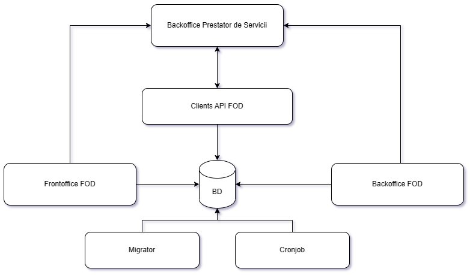

# Structura soluției unui serviciu dezvoltat utilizând FOD

Pe baza experienței acumulate în dezvoltarea mai multor servicii utilizând componentele FOD, s-a conturat o arhitectură recomandată pentru organizarea unui serviciu digital. Această arhitectură este compusă din mai multe proiecte, fiecare cu un rol clar definit în cadrul ecosistemului.

## Componentele soluției

O soluție completă dezvoltată cu FOD este alcătuită, de regulă, din următoarele proiecte:

- **Frontoffice** – interfața utilizatorului final (solicitantul serviciului);
- **Backoffice** – interfața internă a prestatorului de servicii;
- **Clients API** – serviciu intermediar care facilitează comunicarea dintre aplicații (Frontoffice, Backoffice) și baza de date;
- **Migrator** – componentă responsabilă de inițializarea și actualizarea bazei de date (migrări);
- **Cronjob** – proces automat programat, responsabil de sarcini repetitive sau de fundal (ex: notificări, actualizări periodice);
- **Bază de date** – sistemul de stocare a datelor colectate, procesate și livrate în cadrul ciclului de viață al solicitărilor.

## Responsabilitățile serviciului

Un serviciu construit cu FOD trebuie să acopere cele trei etape principale din procesul de prestare a serviciilor publice:

1. **Colectarea informațiilor de la solicitant**  
   Platforma trebuie să asigure o interfață intuitivă și clară pentru completarea formularului de solicitare și transmiterea documentelor necesare.

2. **Monitorizarea procesului de procesare**  
   Solicitantul trebuie să poată urmări stadiul cererii sale, iar prestatorul trebuie să poată gestiona fluxul de procesare, de la înregistrare până la generarea răspunsului final.

3. **Comunicarea rezultatului către solicitant**  
   Platforma trebuie să faciliteze transmiterea răspunsului generat în urma procesării cererii, inclusiv notificări și documente asociate.

> 🛠️ În situațiile în care prestatorul de servicii **nu are infrastructura necesară** pentru procesarea solicitărilor, întreaga logică de procesare poate fi dezvoltată **în cadrul aceleiași soluții**. Astfel, serviciul devine complet autonom, acoperind toate etapele de la depunere la livrare.

---

Această structură modulară permite dezvoltarea rapidă, scalabilă și ușor de întreținut a serviciilor publice digitale, oferind un cadru coerent pentru integrarea în platforma FOD.
