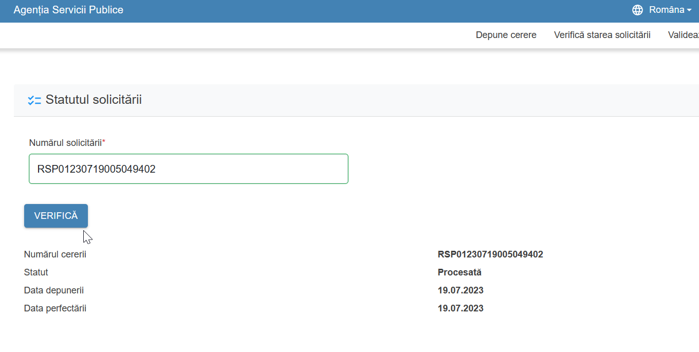

# Verificarea stării unei solicitări

Pentru a asigura transparența și accesul continuu al utilizatorului la informațiile despre cererea depusă, **Frontoffice-ul trebuie să includă o funcționalitate de verificare a stării unei solicitări**.

## Funcționalitate

Această funcționalitate permite solicitantului să:

* Vizualizeze **stadiul actual** al solicitării (ex: în analiză, acceptată, respinsă, în curs de livrare etc.);
* Acceseze eventuale documente emise sau notificări generate pe parcursul procesării;
* Urmărească eventuale acțiuni suplimentare necesare (ex: completarea unor informații, achitarea unei taxe etc.).

## Implementare

* O **componentă reutilizabilă** pentru această funcționalitate este deja disponibilă în cadrul platformei FOD;
* Este responsabilitatea **dezvoltatorului** să:

  * Creeze o **pagină dedicată** în aplicația Frontoffice;
  * **Integreze componenta** disponibilă pentru afișarea stării solicitării;
  * Configureze sursele de date necesare (ex: ID-ul solicitării, token-ul de acces etc.).

## Exemplu vizual

Mai jos este un exemplu vizual al componentei de verificare:

> 🛠️ Integrarea acestei funcționalități este recomandată pentru toate serviciile care presupun un proces de procesare în timp, oferind o experiență completă și transparentă utilizatorului.

---

Verificarea stării solicitării este un element esențial în digitalizarea relației dintre cetățean și administrație, contribuind la creșterea încrederii și eficienței proceselor publice.
