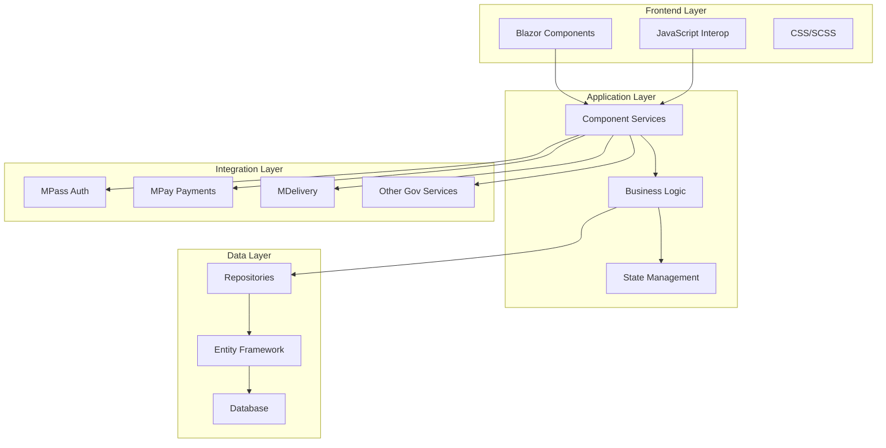
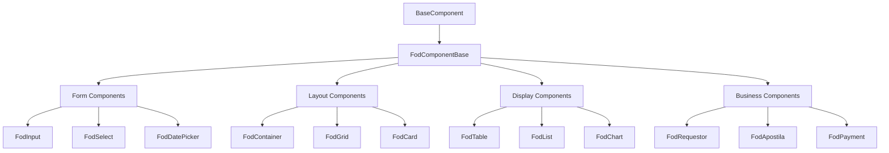
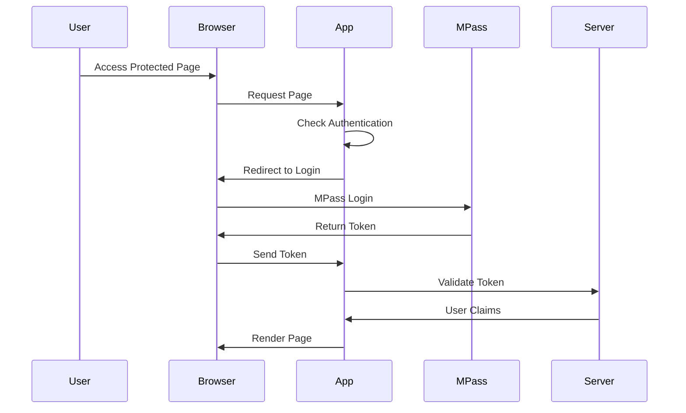
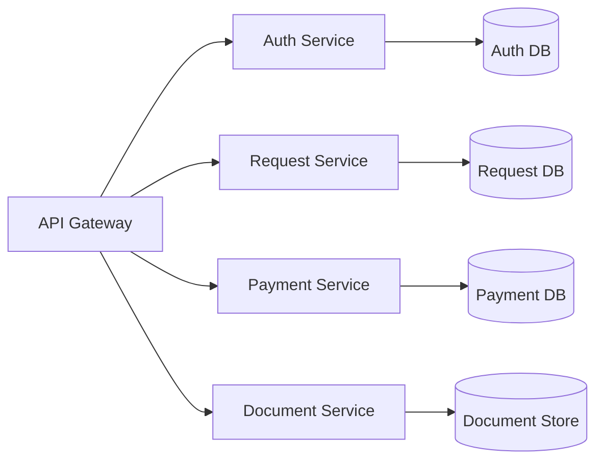

# Arhitectură și Design - FOD.Components

## Prezentare Generală

FOD.Components este construit pe o arhitectură modulară și scalabilă, special concepută pentru cerințele aplicațiilor guvernamentale. Platforma folosește cele mai bune practici din industrie, combinând flexibilitatea Blazor cu robustețea .NET pentru a oferi o soluție completă de dezvoltare.

## Principii Arhitecturale

### 1. **Separarea Responsabilităților (SoC)**
- Componente UI independente și reutilizabile
- Logica de business separată de prezentare
- Servicii dedicate pentru fiecare domeniu funcțional

### 2. **Don't Repeat Yourself (DRY)**
- Componente generice parametrizabile
- Servicii partajate între module
- Stiluri CSS centralizate și variabile

### 3. **SOLID Principles**
- **S**ingle Responsibility: Fiecare componentă are un singur scop
- **O**pen/Closed: Extensibil prin moștenire și compoziție
- **L**iskov Substitution: Interfețe consistente
- **I**nterface Segregation: Interfețe specifice și focusate
- **D**ependency Inversion: Dependențe prin abstracții

### 4. **Security by Design**
- Validare input la toate nivelurile
- Autentificare și autorizare integrate
- Criptare date sensibile
- Audit trail complet

## Arhitectura Sistemului

### Diagrama de Nivel Înalt



### Structura Modulelor

```
FOD.Components/
├── src/
│   ├── FOD.Components/              # Componente UI principale
│   ├── FOD.Components.Server/       # Servicii server-side
│   ├── Fod.Components.Shared/       # Modele și interfețe partajate
│   ├── FOD.EntityFramework/         # Data access layer
│   ├── Fod.Integrations.*/          # Module de integrare
│   └── Fod.Components.Services/     # Servicii business
├── test/
│   └── *.Tests/                     # Proiecte de teste
└── docs/
    └── FOD.Docs/                    # Aplicație documentație
```

## Arhitectura Componentelor

### Ierarhia Componentelor



### Lifecycle Componente

```csharp
public abstract class FodComponentBase : ComponentBase
{
    // 1. Initialization
    protected override void OnInitialized() { }
    protected override async Task OnInitializedAsync() { }
    
    // 2. Parameter Setting
    protected override void OnParametersSet() { }
    protected override async Task OnParametersSetAsync() { }
    
    // 3. After Render
    protected override void OnAfterRender(bool firstRender) { }
    protected override async Task OnAfterRenderAsync(bool firstRender) { }
    
    // 4. Disposal
    public virtual void Dispose() { }
}
```

## Straturile Aplicației

### 1. **Presentation Layer (UI)**

**Responsabilități:**
- Randare componente Blazor
- Gestionare evenimente utilizator
- Binding date
- Validare client-side

**Tehnologii:**
- Blazor WebAssembly/Server
- HTML/CSS/SCSS
- JavaScript Interop

### 2. **Application Layer**

**Responsabilități:**
- Orchestrare procese business
- Transformare date (DTO ↔ Entity)
- Validare business rules
- Cache management

**Componente:**
- Application Services
- DTOs (Data Transfer Objects)
- Mappers
- Validators

### 3. **Domain Layer**

**Responsabilități:**
- Entități business
- Logică de domeniu
- Reguli business
- Domain events

**Componente:**
- Domain Entities
- Value Objects
- Domain Services
- Specifications

### 4. **Infrastructure Layer**

**Responsabilități:**
- Acces la date
- Integrări externe
- Logging
- Caching

**Componente:**
- DbContext
- Repositories
- External Service Clients
- Infrastructure Services

## Design Patterns Utilizate

### 1. **Repository Pattern**

```csharp
public interface IRepository<T> where T : BaseEntity
{
    Task<T> GetByIdAsync(int id);
    Task<IEnumerable<T>> GetAllAsync();
    Task<T> AddAsync(T entity);
    void Update(T entity);
    void Delete(T entity);
}

public class Repository<T> : IRepository<T> where T : BaseEntity
{
    protected readonly DbContext _context;
    protected readonly DbSet<T> _dbSet;
    
    public Repository(DbContext context)
    {
        _context = context;
        _dbSet = context.Set<T>();
    }
    
    // Implementare metode...
}
```

### 2. **Unit of Work Pattern**

```csharp
public interface IUnitOfWork : IDisposable
{
    IRepository<T> Repository<T>() where T : BaseEntity;
    Task<int> SaveChangesAsync();
    Task BeginTransactionAsync();
    Task CommitTransactionAsync();
    Task RollbackTransactionAsync();
}
```

### 3. **Factory Pattern**

```csharp
public interface IComponentFactory<TComponent> where TComponent : IComponent
{
    TComponent Create(ComponentParameters parameters);
}

public class FodInputFactory : IComponentFactory<FodInput>
{
    public FodInput Create(ComponentParameters parameters)
    {
        return parameters.Type switch
        {
            "text" => new FodInputText(parameters),
            "number" => new FodInputNumber(parameters),
            "date" => new FodDatePicker(parameters),
            _ => new FodInput(parameters)
        };
    }
}
```

### 4. **Observer Pattern**

```csharp
public interface INotificationService
{
    event EventHandler<NotificationEventArgs> OnNotification;
    void Subscribe(Action<NotificationEventArgs> handler);
    void Unsubscribe(Action<NotificationEventArgs> handler);
    Task NotifyAsync(string message, NotificationType type);
}
```

### 5. **Strategy Pattern**

```csharp
public interface IValidationStrategy
{
    ValidationResult Validate(object value);
}

public class EmailValidationStrategy : IValidationStrategy
{
    public ValidationResult Validate(object value)
    {
        var email = value?.ToString();
        if (string.IsNullOrEmpty(email) || !email.Contains("@"))
        {
            return ValidationResult.Error("Email invalid");
        }
        return ValidationResult.Success();
    }
}
```

## Dependency Injection

### Configurare Servicii

```csharp
public static class ServiceCollectionExtensions
{
    public static IServiceCollection AddFodComponents(
        this IServiceCollection services,
        Action<FodComponentsOptions> configure = null)
    {
        // Configurare opțiuni
        var options = new FodComponentsOptions();
        configure?.Invoke(options);
        services.AddSingleton(options);
        
        // Înregistrare servicii componente
        services.AddScoped<IAuthenticationService, AuthenticationService>();
        services.AddScoped<IUserService, UserService>();
        services.AddScoped<INotificationService, NotificationService>();
        
        // Înregistrare factories
        services.AddTransient<IComponentFactory<FodInput>, FodInputFactory>();
        
        // Înregistrare repositories
        services.AddScoped(typeof(IRepository<>), typeof(Repository<>));
        services.AddScoped<IUnitOfWork, UnitOfWork>();
        
        return services;
    }
}
```

### Lifecycle Management

```csharp
// Singleton - o singură instanță pentru toată aplicația
services.AddSingleton<IConfigurationService, ConfigurationService>();

// Scoped - o instanță per request/connection
services.AddScoped<IUserContextService, UserContextService>();

// Transient - o instanță nouă de fiecare dată
services.AddTransient<IEmailService, EmailService>();
```

## State Management

### 1. **Component State**

```csharp
public class FodDataTable<TItem> : FodComponentBase
{
    // Local state
    private List<TItem> _items = new();
    private int _currentPage = 1;
    private string _searchTerm = string.Empty;
    
    // Parameters
    [Parameter] public IEnumerable<TItem> Items { get; set; }
    [Parameter] public int PageSize { get; set; } = 10;
    
    // Computed properties
    private IEnumerable<TItem> FilteredItems => 
        _items.Where(item => MatchesSearch(item, _searchTerm));
        
    private IEnumerable<TItem> PagedItems => 
        FilteredItems
            .Skip((_currentPage - 1) * PageSize)
            .Take(PageSize);
}
```

### 2. **Application State**

```csharp
public interface IStateManager
{
    T GetState<T>(string key) where T : class;
    void SetState<T>(string key, T value) where T : class;
    void RemoveState(string key);
    event EventHandler<StateChangedEventArgs> StateChanged;
}

public class StateManager : IStateManager
{
    private readonly Dictionary<string, object> _state = new();
    public event EventHandler<StateChangedEventArgs> StateChanged;
    
    public T GetState<T>(string key) where T : class
    {
        return _state.TryGetValue(key, out var value) ? value as T : null;
    }
    
    public void SetState<T>(string key, T value) where T : class
    {
        _state[key] = value;
        StateChanged?.Invoke(this, new StateChangedEventArgs(key));
    }
}
```

### 3. **Cascading State**

```razor
<CascadingValue Value="@UserContext">
    <CascadingValue Value="@ThemeSettings">
        <Router AppAssembly="@typeof(App).Assembly">
            <Found Context="routeData">
                <RouteView RouteData="@routeData" DefaultLayout="@typeof(MainLayout)" />
            </Found>
        </Router>
    </CascadingValue>
</CascadingValue>

@code {
    private UserContext UserContext { get; set; }
    private ThemeSettings ThemeSettings { get; set; }
}
```

## Event Handling și Communication

### 1. **Component Events**

```csharp
public class FodButton : FodComponentBase
{
    [Parameter] public EventCallback<MouseEventArgs> OnClick { get; set; }
    [Parameter] public EventCallback<FocusEventArgs> OnFocus { get; set; }
    [Parameter] public EventCallback<FocusEventArgs> OnBlur { get; set; }
    
    private async Task HandleClick(MouseEventArgs e)
    {
        if (!Disabled)
        {
            await OnClick.InvokeAsync(e);
        }
    }
}
```

### 2. **Event Aggregator**

```csharp
public interface IEventAggregator
{
    void Subscribe<TEvent>(Action<TEvent> handler);
    void Unsubscribe<TEvent>(Action<TEvent> handler);
    Task PublishAsync<TEvent>(TEvent eventData);
}

public class EventAggregator : IEventAggregator
{
    private readonly Dictionary<Type, List<Delegate>> _handlers = new();
    
    public void Subscribe<TEvent>(Action<TEvent> handler)
    {
        var eventType = typeof(TEvent);
        if (!_handlers.ContainsKey(eventType))
        {
            _handlers[eventType] = new List<Delegate>();
        }
        _handlers[eventType].Add(handler);
    }
    
    public async Task PublishAsync<TEvent>(TEvent eventData)
    {
        var eventType = typeof(TEvent);
        if (_handlers.TryGetValue(eventType, out var handlers))
        {
            foreach (Action<TEvent> handler in handlers)
            {
                await Task.Run(() => handler(eventData));
            }
        }
    }
}
```

## Securitate Arhitecturală

### 1. **Authentication Flow**



### 2. **Authorization Layers**

```csharp
// Component level
[Authorize(Roles = "Admin,Manager")]
public class AdminDashboard : FodComponentBase { }

// Method level
[Authorize(Policy = "CanEditRequests")]
public async Task UpdateRequest(RequestDto request) { }

// Code level
@if (AuthorizationService.AuthorizeAsync(User, "CanDelete").Result.Succeeded)
{
    <FodButton OnClick="Delete">Șterge</FodButton>
}
```

### 3. **Data Protection**

```csharp
public class EncryptionService : IEncryptionService
{
    private readonly IDataProtector _protector;
    
    public EncryptionService(IDataProtectionProvider provider)
    {
        _protector = provider.CreateProtector("FOD.Components.Encryption");
    }
    
    public string Encrypt(string plainText)
    {
        return _protector.Protect(plainText);
    }
    
    public string Decrypt(string cipherText)
    {
        return _protector.Unprotect(cipherText);
    }
}
```

## Performance Optimization

### 1. **Lazy Loading**

```csharp
public class FodVirtualize<TItem> : FodComponentBase
{
    [Parameter] public ItemsProviderDelegate<TItem> ItemsProvider { get; set; }
    [Parameter] public RenderFragment<TItem> ItemTemplate { get; set; }
    [Parameter] public float ItemSize { get; set; } = 50f;
    
    private async ValueTask<ItemsProviderResult<TItem>> LoadItems(
        ItemsProviderRequest request)
    {
        var items = await ItemsProvider(request);
        return items;
    }
}
```

### 2. **Caching Strategy**

```csharp
public class CacheService : ICacheService
{
    private readonly IMemoryCache _memoryCache;
    private readonly IDistributedCache _distributedCache;
    
    public async Task<T> GetOrCreateAsync<T>(
        string key, 
        Func<Task<T>> factory,
        CacheOptions options = null)
    {
        // L1 Cache - Memory
        if (_memoryCache.TryGetValue(key, out T cachedValue))
        {
            return cachedValue;
        }
        
        // L2 Cache - Distributed
        var distributedValue = await _distributedCache.GetAsync(key);
        if (distributedValue != null)
        {
            var value = JsonSerializer.Deserialize<T>(distributedValue);
            _memoryCache.Set(key, value, options?.MemoryExpiration);
            return value;
        }
        
        // Generate value
        var newValue = await factory();
        
        // Store in both caches
        await SetAsync(key, newValue, options);
        
        return newValue;
    }
}
```

### 3. **Component Optimization**

```csharp
public class OptimizedComponent : FodComponentBase, IDisposable
{
    private readonly CancellationTokenSource _cts = new();
    private Timer _debounceTimer;
    
    // Prevent unnecessary renders
    protected override bool ShouldRender()
    {
        return HasStateChanged();
    }
    
    // Debounce expensive operations
    private void OnSearchInput(ChangeEventArgs e)
    {
        _debounceTimer?.Dispose();
        _debounceTimer = new Timer(async _ =>
        {
            await InvokeAsync(async () =>
            {
                await PerformSearch(e.Value.ToString());
                StateHasChanged();
            });
        }, null, 300, Timeout.Infinite);
    }
    
    public void Dispose()
    {
        _cts?.Cancel();
        _cts?.Dispose();
        _debounceTimer?.Dispose();
    }
}
```

## Scalability Considerations

### 1. **Microservices Ready**



### 2. **Message Queue Integration**

```csharp
public interface IMessageBus
{
    Task PublishAsync<T>(T message, string topic = null);
    Task SubscribeAsync<T>(string topic, Func<T, Task> handler);
}

public class ServiceBusMessageBus : IMessageBus
{
    private readonly ServiceBusClient _client;
    
    public async Task PublishAsync<T>(T message, string topic = null)
    {
        var sender = _client.CreateSender(topic ?? typeof(T).Name);
        var json = JsonSerializer.Serialize(message);
        await sender.SendMessageAsync(new ServiceBusMessage(json));
    }
}
```

### 3. **Load Balancing**

```csharp
public class LoadBalancedHttpClient
{
    private readonly List<string> _endpoints;
    private int _currentIndex = 0;
    
    public async Task<T> GetAsync<T>(string path)
    {
        var endpoint = GetNextEndpoint();
        using var client = new HttpClient { BaseAddress = new Uri(endpoint) };
        
        var response = await client.GetAsync(path);
        response.EnsureSuccessStatusCode();
        
        var json = await response.Content.ReadAsStringAsync();
        return JsonSerializer.Deserialize<T>(json);
    }
    
    private string GetNextEndpoint()
    {
        var endpoint = _endpoints[_currentIndex];
        _currentIndex = (_currentIndex + 1) % _endpoints.Count;
        return endpoint;
    }
}
```

## Deployment Architecture

### 1. **Container Support**

```dockerfile
# Dockerfile
FROM mcr.microsoft.com/dotnet/aspnet:8.0 AS base
WORKDIR /app
EXPOSE 80
EXPOSE 443

FROM mcr.microsoft.com/dotnet/sdk:8.0 AS build
WORKDIR /src
COPY ["FOD.Components.sln", "."]
COPY ["src/FOD.Components/FOD.Components.csproj", "src/FOD.Components/"]
RUN dotnet restore

COPY . .
WORKDIR "/src/src/FOD.Components"
RUN dotnet build -c Release -o /app/build

FROM build AS publish
RUN dotnet publish -c Release -o /app/publish

FROM base AS final
WORKDIR /app
COPY --from=publish /app/publish .
ENTRYPOINT ["dotnet", "FOD.Components.dll"]
```

### 2. **Kubernetes Deployment**

```yaml
apiVersion: apps/v1
kind: Deployment
metadata:
  name: fod-components
spec:
  replicas: 3
  selector:
    matchLabels:
      app: fod-components
  template:
    metadata:
      labels:
        app: fod-components
    spec:
      containers:
      - name: fod-components
        image: fodregistry.azurecr.io/fod-components:latest
        ports:
        - containerPort: 80
        env:
        - name: ASPNETCORE_ENVIRONMENT
          value: "Production"
        resources:
          requests:
            memory: "256Mi"
            cpu: "250m"
          limits:
            memory: "512Mi"
            cpu: "500m"
```

## Monitoring și Observability

### 1. **Structured Logging**

```csharp
public class LoggingService : ILoggingService
{
    private readonly ILogger<LoggingService> _logger;
    
    public void LogOperation(string operation, object parameters, TimeSpan duration)
    {
        using (_logger.BeginScope(new Dictionary<string, object>
        {
            ["Operation"] = operation,
            ["Duration"] = duration.TotalMilliseconds,
            ["Timestamp"] = DateTime.UtcNow
        }))
        {
            _logger.LogInformation(
                "Operation {Operation} completed in {Duration}ms",
                operation,
                duration.TotalMilliseconds);
        }
    }
}
```

### 2. **Health Checks**

```csharp
public class FodHealthCheck : IHealthCheck
{
    private readonly IDbContext _dbContext;
    private readonly IEnumerable<IExternalService> _externalServices;
    
    public async Task<HealthCheckResult> CheckHealthAsync(
        HealthCheckContext context,
        CancellationToken cancellationToken = default)
    {
        try
        {
            // Check database
            await _dbContext.Database.CanConnectAsync(cancellationToken);
            
            // Check external services
            foreach (var service in _externalServices)
            {
                await service.CheckHealthAsync(cancellationToken);
            }
            
            return HealthCheckResult.Healthy("All systems operational");
        }
        catch (Exception ex)
        {
            return HealthCheckResult.Unhealthy("System check failed", ex);
        }
    }
}
```

## Concluzie

Arhitectura FOD.Components este concepută pentru a oferi maximum de flexibilitate și scalabilitate, respectând în același timp cerințele stricte de securitate și performanță ale aplicațiilor guvernamentale. Prin utilizarea pattern-urilor moderne și a celor mai bune practici, platforma asigură dezvoltarea rapidă a aplicațiilor robuste și ușor de întreținut.