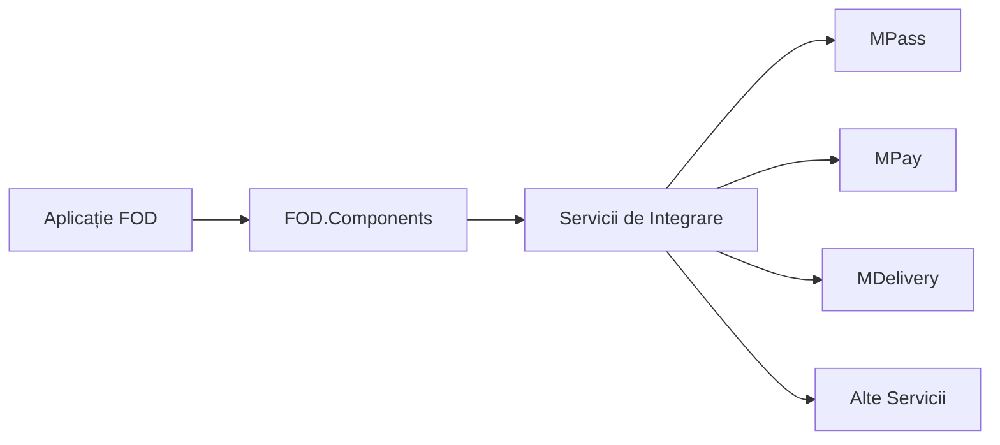

# Integrări Servicii Guvernamentale

## Prezentare Generală

Platforma FOD.Components oferă integrări robuste cu principalele servicii guvernamentale digitale din Republica Moldova. Aceste integrări permit aplicațiilor să beneficieze de serviciile centralizate ale guvernului, asigurând o experiență uniformă și sigură pentru cetățeni.

## Servicii Integrate

### 🔐 MPass - Serviciul de Autentificare
MPass este serviciul național de autentificare care permite cetățenilor să acceseze toate serviciile publice digitale cu o singură identitate digitală.

**Caracteristici principale:**
- Autentificare unificată pentru toate serviciile publice
- Suport pentru multiple metode de autentificare (ID mobil, semnătură digitală)
- Single Sign-On (SSO) pentru aplicațiile guvernamentale
- Gestionare centralizată a sesiunilor

[Documentație detaliată MPass →](mpass/index.md)

### 💳 MPay - Serviciul de Plăți Electronice
MPay oferă o platformă centralizată pentru efectuarea plăților către instituțiile publice, integrând multiple metode de plată.

**Caracteristici principale:**
- Plăți online securizate
- Integrare cu băncile comerciale
- Generare automată a facturilor
- Monitorizare în timp real a tranzacțiilor

[Documentație detaliată MPay →](mpay/index.md)

### 📦 MDelivery - Serviciul de Livrare Documente
MDelivery facilitează livrarea electronică și fizică a documentelor oficiale către cetățeni.

**Caracteristici principale:**
- Livrare electronică prin cabinet personal
- Integrare cu serviciile poștale pentru livrare fizică
- Tracking în timp real al livrărilor
- Confirmare electronică de primire

[Documentație detaliată MDelivery →](mdelivery/index.md)

### 🏛️ MPower - Serviciul de Împuterniciri
MPower permite delegarea electronică a drepturilor de reprezentare între persoane fizice și juridice.

**Caracteristici principale:**
- Creare și gestionare împuterniciri electronice
- Verificare în timp real a validității
- Istoric complet al delegărilor
- Integrare cu registrele de stat

[Documentație detaliată MPower →](mpower/index.md)

### 🔗 MConnect - Platforma de Interoperabilitate
MConnect asigură schimbul securizat de date între sistemele informaționale ale instituțiilor publice.

**Caracteristici principale:**
- Schimb standardizat de date
- Protocoale de securitate avansate
- Monitorizare și audit
- API-uri unificate

[Documentație detaliată MConnect →](mconnect/index.md)

### 👤 SGARI - Sistemul de Gestiune a Actelor de Stare Civilă
SGARI oferă acces la datele din registrele de stare civilă și populație.

**Caracteristici principale:**
- Verificare date personale
- Acces la acte de stare civilă
- Validare IDNP
- Istoric modificări

[Documentație detaliată SGARI →](sgari/index.md)

### 🌐 PSP - Portalul Serviciilor Publice
PSP reprezintă catalogul centralizat al tuturor serviciilor publice disponibile electronic.

**Caracteristici principale:**
- Catalog complet de servicii
- Informații detaliate despre cerințe
- Ghiduri pas cu pas
- Integrare cu alte platforme

[Documentație detaliată PSP →](psp/index.md)

### 📄 DocStore - Depozitul Electronic de Documente
DocStore oferă stocare securizată și gestionare centralizată a documentelor electronice.

**Caracteristici principale:**
- Stocare criptată
- Versionare documente
- Semnare digitală integrată
- Partajare securizată

[Documentație detaliată DocStore →](docstore/index.md)

### 🏛️ Apostila - Serviciul de Apostilare
Serviciul electronic de apostilare a documentelor pentru utilizare internațională.

**Caracteristici principale:**
- Apostilare electronică
- Verificare online a apostilelor
- Integrare cu convenția de la Haga
- Reducere semnificativă a timpilor

[Documentație detaliată Apostila →](apostila/index.md)

## Arhitectură de Integrare

### Principii de Design

1. **Modularitate** - Fiecare integrare este implementată ca un modul independent
2. **Reutilizabilitate** - Componente și servicii comune pentru toate integrările
3. **Securitate** - Protocoale de securitate standardizate și audit complet
4. **Performanță** - Optimizări pentru răspuns rapid și scalabilitate

### Model de Integrare



## Configurare Generală

### 1. Înregistrarea Serviciilor

Toate integrările se înregistrează în `Program.cs`:

```csharp
// MPass
builder.Services.AddMPassAuthentication(options =>
{
    options.ClientId = configuration["MPass:ClientId"];
    options.ClientSecret = configuration["MPass:ClientSecret"];
});

// MPay
builder.Services.AddMPayIntegration(options =>
{
    options.MerchantId = configuration["MPay:MerchantId"];
    options.ApiKey = configuration["MPay:ApiKey"];
});

// MDelivery
builder.Services.AddMDeliveryService(options =>
{
    options.ServiceUrl = configuration["MDelivery:ServiceUrl"];
});
```

### 2. Configurare AppSettings

```json
{
  "MPass": {
    "ClientId": "your-client-id",
    "ClientSecret": "your-client-secret",
    "Authority": "https://mpass.gov.md"
  },
  "MPay": {
    "MerchantId": "your-merchant-id",
    "ApiKey": "your-api-key",
    "Environment": "Production"
  },
  "MDelivery": {
    "ServiceUrl": "https://mdelivery.gov.md/api",
    "ApiKey": "your-api-key"
  }
}
```

## Securitate și Conformitate

### Standarde de Securitate

- **OAuth 2.0 / OpenID Connect** pentru autentificare
- **TLS 1.2+** pentru toate comunicațiile
- **Semnătură digitală** pentru documente oficiale
- **Criptare end-to-end** pentru date sensibile

### Conformitate Legală

- Respectarea GDPR și legislației naționale
- Audit trail complet pentru toate operațiunile
- Păstrarea datelor conform cerințelor legale
- Acces controlat pe bază de roluri

## Monitorizare și Logging

### Metrici Importante

- Timp de răspuns pentru fiecare serviciu
- Rata de succes/eroare
- Volum de tranzacții
- Disponibilitate servicii

### Configurare Logging

```csharp
builder.Services.AddLogging(config =>
{
    config.AddConfiguration(configuration.GetSection("Logging"));
    config.AddConsole();
    config.AddDebug();
    config.AddEventSourceLogger();
});
```

## Tratare Erori

### Strategii de Resilience

1. **Retry Policies** - Reîncercare automată în caz de erori temporare
2. **Circuit Breaker** - Protecție împotriva serviciilor indisponibile
3. **Timeout Management** - Gestionare timeout-uri pentru fiecare serviciu
4. **Fallback Mechanisms** - Comportament alternativ în caz de eroare

### Exemplu Implementare

```csharp
services.AddHttpClient<IMPayService>()
    .AddPolicyHandler(GetRetryPolicy())
    .AddPolicyHandler(GetCircuitBreakerPolicy());

static IAsyncPolicy<HttpResponseMessage> GetRetryPolicy()
{
    return HttpPolicyExtensions
        .HandleTransientHttpError()
        .WaitAndRetryAsync(
            3,
            retryAttempt => TimeSpan.FromSeconds(Math.Pow(2, retryAttempt)),
            onRetry: (outcome, timespan, retryCount, context) =>
            {
                // Log retry attempt
            });
}
```

## Suport și Resurse

### Documentație Oficială

- [MPass Documentation](https://mpass.gov.md/docs)
- [MPay Integration Guide](https://mpay.gov.md/developers)
- [MConnect API Reference](https://mconnect.gov.md/api)

### Contacte Suport

- **Suport Tehnic**: support@egov.md
- **Întrebări Comerciale**: business@egov.md
- **Raportare Probleme**: [GitHub Issues](https://github.com/egov-moldova)

## Roadmap

### Planificate pentru 2024

- Integrare cu MSign pentru semnătură mobilă
- Suport pentru MNotify - notificări push
- API unificat pentru toate serviciile
- Dashboard de monitorizare integrat

### În Dezvoltare

- Componente React pentru integrări
- SDK-uri pentru alte limbaje
- Documentație interactivă
- Exemple de cod extinse

## Concluzie

Integrările cu serviciile guvernamentale reprezintă fundamentul pentru dezvoltarea aplicațiilor de e-guvernare moderne. FOD.Components oferă toate instrumentele necesare pentru o integrare rapidă și sigură cu ecosistemul digital guvernamental din Moldova.

Pentru asistență suplimentară sau întrebări specifice, consultați documentația detaliată pentru fiecare serviciu sau contactați echipa de suport.