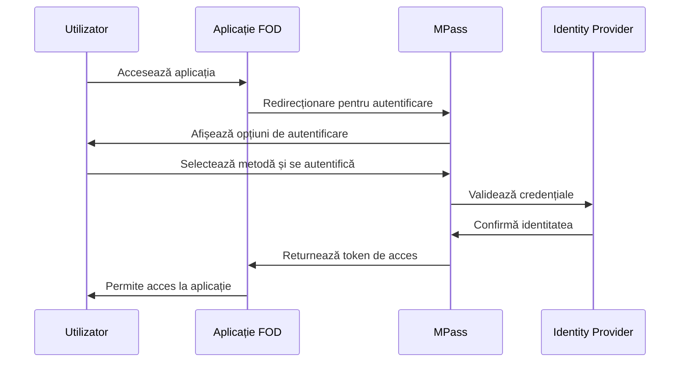

# MPass - Serviciul de Autentificare

## Introducere

MPass este serviciul național de autentificare electronică al Republicii Moldova, care oferă o soluție unificată pentru accesarea tuturor serviciilor publice digitale. Integrarea MPass în aplicațiile FOD permite cetățenilor să se autentifice o singură dată și să acceseze multiple servicii guvernamentale fără a fi nevoiți să se re-autentifice.

## Caracteristici Principale

### 🔐 Metode de Autentificare Suportate

1. **Semnătură Digitală** - Utilizând certificate digitale calificate
2. **ID Mobil** - Autentificare prin telefon mobil
3. **Nume utilizator și parolă** - Pentru servicii mai puțin critice
4. **Semnătură Mobilă** - În dezvoltare

### 🌟 Beneficii

- **Single Sign-On (SSO)** - O singură autentificare pentru toate serviciile
- **Securitate sporită** - Protocoale moderne de securitate
- **Experiență uniformă** - Interfață consistentă pentru toate aplicațiile
- **Gestionare centralizată** - Administrare unificată a utilizatorilor

## Arhitectură Tehnică

### Flux de Autentificare



### Componente Principale

1. **Fod.Integrations.MPass** - Librăria principală de integrare
2. **MPassAuthenticationHandler** - Handler pentru procesarea autentificării
3. **MPassOptions** - Configurări pentru serviciul MPass
4. **MPassClaimsTransformation** - Transformarea claim-urilor în context utilizator

## Configurare și Instalare

### 1. Instalare Pachet NuGet

```bash
dotnet add package Fod.Integrations.MPass
```

### 2. Configurare în Program.cs

```csharp
using Fod.Integrations.MPass;

var builder = WebApplication.CreateBuilder(args);

// Adaugă serviciile MPass
builder.Services.AddAuthentication(options =>
{
    options.DefaultScheme = CookieAuthenticationDefaults.AuthenticationScheme;
    options.DefaultChallengeScheme = MPassDefaults.AuthenticationScheme;
})
.AddCookie()
.AddMPass(options =>
{
    options.ClientId = builder.Configuration["MPass:ClientId"];
    options.ClientSecret = builder.Configuration["MPass:ClientSecret"];
    options.Authority = builder.Configuration["MPass:Authority"];
    options.CallbackPath = "/signin-mpass";
    options.SignedOutCallbackPath = "/signout-callback-mpass";
    
    // Configurări adiționale
    options.SaveTokens = true;
    options.GetClaimsFromUserInfoEndpoint = true;
    
    // Scope-uri necesare
    options.Scope.Add("openid");
    options.Scope.Add("profile");
    options.Scope.Add("email");
    options.Scope.Add("phone");
});

// Adaugă serviciile FOD pentru MPass
builder.Services.AddMPassIntegration();

var app = builder.Build();

// Activează autentificarea
app.UseAuthentication();
app.UseAuthorization();
```

### 3. Configurare AppSettings

```json
{
  "MPass": {
    "ClientId": "your-application-client-id",
    "ClientSecret": "your-application-client-secret",
    "Authority": "https://mpass.gov.md",
    "ResponseType": "code",
    "SaveTokens": true,
    "RequireHttpsMetadata": true,
    "ValidateIssuer": true,
    "ValidateAudience": true,
    "NameClaimType": "name",
    "RoleClaimType": "role"
  }
}
```

## Utilizare în Componente

### 1. Componenta de Login

```razor
@page "/login"
@using Microsoft.AspNetCore.Authentication
@inject NavigationManager Navigation

<FodCard>
    <FodCardContent>
        <h2>Autentificare MPass</h2>
        <p>Pentru a accesa serviciile, vă rugăm să vă autentificați folosind MPass.</p>
        
        <FodButton OnClick="Login" Variant="primary" FullWidth="true">
            <FodIcon Name="mpass-logo" /> Autentificare cu MPass
        </FodButton>
    </FodCardContent>
</FodCard>

@code {
    private async Task Login()
    {
        var authProps = new AuthenticationProperties
        {
            RedirectUri = "/",
            IsPersistent = true
        };
        
        Navigation.NavigateTo($"/authentication/login?returnUrl={Uri.EscapeDataString(Navigation.Uri)}", true);
    }
}
```

### 2. Afișare Informații Utilizator

```razor
@page "/profile"
@using System.Security.Claims
@inject AuthenticationStateProvider AuthenticationStateProvider

<AuthorizeView>
    <Authorized>
        <FodCard>
            <FodCardContent>
                <h3>Profil Utilizator</h3>
                <dl>
                    <dt>Nume:</dt>
                    <dd>@context.User.FindFirst(ClaimTypes.Name)?.Value</dd>
                    
                    <dt>Email:</dt>
                    <dd>@context.User.FindFirst(ClaimTypes.Email)?.Value</dd>
                    
                    <dt>IDNP:</dt>
                    <dd>@context.User.FindFirst("idnp")?.Value</dd>
                    
                    <dt>Tip Autentificare:</dt>
                    <dd>@context.User.FindFirst("auth_method")?.Value</dd>
                </dl>
            </FodCardContent>
        </FodCard>
    </Authorized>
    <NotAuthorized>
        <FodAlert Type="info">
            Trebuie să vă autentificați pentru a vedea profilul.
        </FodAlert>
    </NotAuthorized>
</AuthorizeView>
```

### 3. Protejare Pagini

```razor
@page "/servicii-protejate"
@attribute [Authorize]

<h1>Servicii Protejate</h1>
<p>Această pagină este accesibilă doar utilizatorilor autentificați.</p>
```

## Gestionare Roluri și Permisiuni

### 1. Configurare Roluri

```csharp
builder.Services.Configure<MPassOptions>(options =>
{
    options.ClaimActions.MapJsonKey("role", "role");
    options.ClaimActions.MapJsonKey("permissions", "permissions");
    options.ClaimActions.MapJsonKey("organization", "organization");
});
```

### 2. Verificare Roluri în Componente

```razor
@page "/admin"
@attribute [Authorize(Roles = "Administrator")]

<h1>Panou Administrare</h1>

<AuthorizeView Roles="Administrator,Manager">
    <Authorized>
        <p>Aveți acces la funcțiile administrative.</p>
    </Authorized>
    <NotAuthorized>
        <FodAlert Type="error">
            Nu aveți permisiunile necesare pentru această pagină.
        </FodAlert>
    </NotAuthorized>
</AuthorizeView>
```

## Servicii Auxiliare

### 1. IMPassUserService

```csharp
public interface IMPassUserService
{
    Task<MPassUser> GetCurrentUserAsync();
    Task<bool> HasPermissionAsync(string permission);
    Task<IEnumerable<string>> GetUserRolesAsync();
    Task<string> GetUserOrganizationAsync();
}
```

### 2. Utilizare în Cod

```csharp
@inject IMPassUserService UserService

@code {
    private MPassUser currentUser;
    
    protected override async Task OnInitializedAsync()
    {
        currentUser = await UserService.GetCurrentUserAsync();
        
        if (!await UserService.HasPermissionAsync("view_sensitive_data"))
        {
            Navigation.NavigateTo("/unauthorized");
        }
    }
}
```

## Gestionare Token-uri

### 1. Refresh Token

```csharp
public class MPassTokenService : IMPassTokenService
{
    public async Task<string> GetAccessTokenAsync()
    {
        var authenticateResult = await _httpContextAccessor.HttpContext
            .AuthenticateAsync(CookieAuthenticationDefaults.AuthenticationScheme);
            
        if (authenticateResult?.Properties?.Items != null && 
            authenticateResult.Properties.Items.TryGetValue(".Token.access_token", out var token))
        {
            return token;
        }
        
        return null;
    }
    
    public async Task<bool> RefreshTokenAsync()
    {
        // Implementare refresh token
    }
}
```

### 2. Interceptor pentru API Calls

```csharp
public class MPassAuthorizationMessageHandler : DelegatingHandler
{
    private readonly IMPassTokenService _tokenService;
    
    protected override async Task<HttpResponseMessage> SendAsync(
        HttpRequestMessage request, 
        CancellationToken cancellationToken)
    {
        var token = await _tokenService.GetAccessTokenAsync();
        
        if (!string.IsNullOrEmpty(token))
        {
            request.Headers.Authorization = 
                new AuthenticationHeaderValue("Bearer", token);
        }
        
        return await base.SendAsync(request, cancellationToken);
    }
}
```

## Logout și Session Management

### 1. Implementare Logout

```csharp
@page "/logout"
@inject NavigationManager Navigation

@code {
    protected override void OnInitialized()
    {
        Navigation.NavigateTo("/authentication/logout", true);
    }
}
```

### 2. Session Timeout

```csharp
builder.Services.ConfigureApplicationCookie(options =>
{
    options.ExpireTimeSpan = TimeSpan.FromMinutes(30);
    options.SlidingExpiration = true;
    options.Events.OnRedirectToLogin = context =>
    {
        context.Response.StatusCode = 401;
        return Task.CompletedTask;
    };
});
```

## Tratare Erori

### 1. Handler pentru Erori de Autentificare

```csharp
builder.Services.Configure<MPassOptions>(options =>
{
    options.Events.OnRemoteFailure = context =>
    {
        context.Response.Redirect($"/authentication/error?message={context.Failure.Message}");
        context.HandleResponse();
        return Task.CompletedTask;
    };
});
```

### 2. Pagină de Eroare

```razor
@page "/authentication/error"

<FodAlert Type="error">
    <h4>Eroare de Autentificare</h4>
    <p>@ErrorMessage</p>
    <FodButton OnClick="@(() => Navigation.NavigateTo("/"))">
        Înapoi la Pagina Principală
    </FodButton>
</FodAlert>

@code {
    [Parameter]
    [SupplyParameterFromQuery]
    public string ErrorMessage { get; set; }
}
```

## Logging și Monitorizare

### 1. Configurare Logging

```csharp
builder.Services.Configure<MPassOptions>(options =>
{
    options.Events.OnTokenValidated = context =>
    {
        var logger = context.HttpContext.RequestServices
            .GetRequiredService<ILogger<Program>>();
        
        logger.LogInformation("User {UserId} authenticated successfully", 
            context.Principal.FindFirst("sub")?.Value);
        
        return Task.CompletedTask;
    };
});
```

### 2. Audit Trail

```csharp
public class MPassAuditService
{
    public async Task LogAuthenticationAsync(ClaimsPrincipal user, string action)
    {
        var auditEntry = new AuditEntry
        {
            UserId = user.FindFirst("sub")?.Value,
            UserName = user.Identity?.Name,
            Action = action,
            Timestamp = DateTime.UtcNow,
            IpAddress = GetClientIpAddress(),
            UserAgent = GetUserAgent()
        };
        
        await _auditRepository.AddAsync(auditEntry);
    }
}
```

## Testare

### 1. Mediu de Test

```json
{
  "MPass": {
    "Authority": "https://test-mpass.gov.md",
    "ClientId": "test-client-id",
    "ClientSecret": "test-client-secret",
    "UseTestUsers": true
  }
}
```

### 2. Mock Authentication pentru Development

```csharp
#if DEBUG
builder.Services.AddAuthentication("Test")
    .AddScheme<TestAuthenticationSchemeOptions, TestAuthenticationHandler>(
        "Test", options => { });
#endif
```

## Troubleshooting

### Probleme Comune

1. **"Invalid redirect_uri"**
   - Verificați că CallbackPath este înregistrat în MPass
   - Asigurați-vă că URL-ul aplicației este corect

2. **"Access denied"**
   - Verificați scope-urile solicitate
   - Confirmați că aplicația are permisiunile necesare

3. **Token expirat**
   - Implementați refresh token
   - Configurați corect sliding expiration

### Debug Mode

```csharp
builder.Services.Configure<MPassOptions>(options =>
{
    options.Events.OnMessageReceived = context =>
    {
        _logger.LogDebug("Message received: {Message}", 
            JsonSerializer.Serialize(context.Request.Query));
        return Task.CompletedTask;
    };
});
```

## Resurse Adiționale

- [Documentație Oficială MPass](https://mpass.gov.md/docs)
- [Exemple de Cod](https://github.com/egov-moldova/mpass-examples)
- [API Reference](https://mpass.gov.md/api-reference)
- [Ghid de Migrare](https://mpass.gov.md/migration-guide)

## Concluzie

Integrarea MPass oferă o soluție robustă și sigură pentru autentificarea utilizatorilor în aplicațiile guvernamentale. Prin utilizarea componentelor și serviciilor FOD, dezvoltatorii pot implementa rapid autentificarea MPass, beneficiind de toate avantajele unui sistem centralizat de identitate digitală.