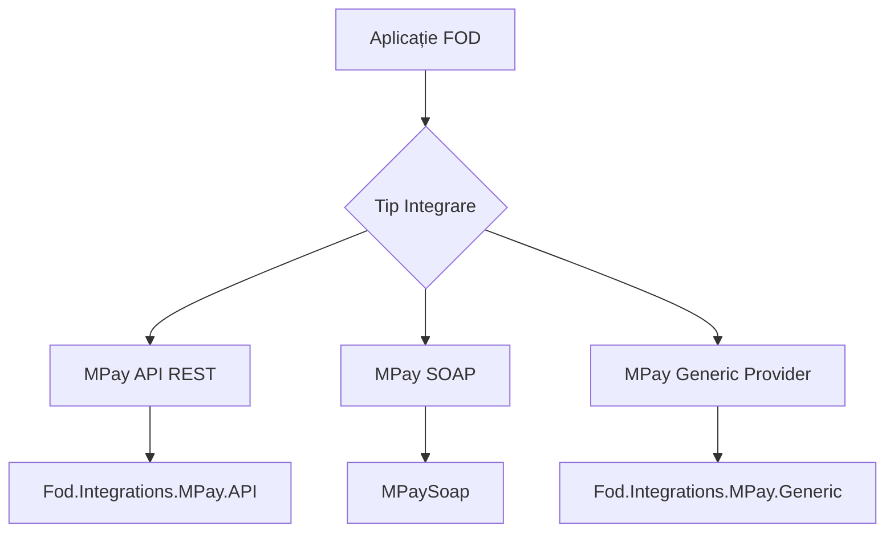
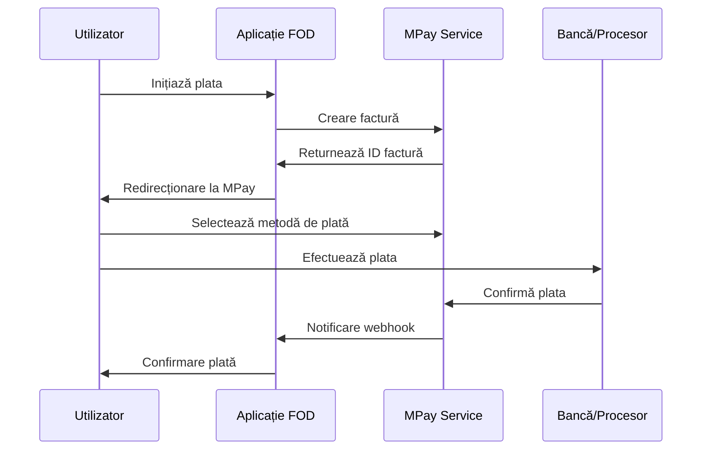

# MPay - Serviciul de Plăți Electronice

## Introducere

MPay este serviciul guvernamental unificat de plăți electronice al Republicii Moldova, care permite cetățenilor și agenților economici să efectueze plăți către instituțiile publice într-un mod sigur și convenabil. Platforma FOD.Components oferă integrare completă cu MPay prin multiple modalități: API REST, SOAP și Generic Provider.

## Caracteristici Principale

### 💳 Metode de Plată Suportate

1. **Card bancar** - Visa, Mastercard, plăți locale
2. **Internet Banking** - Toate băncile comerciale din Moldova
3. **Terminale de plată** - Rețeaua națională de terminale
4. **Portofel electronic** - MPay Wallet
5. **Transfer bancar** - Pentru plăți corporate

### 🌟 Funcționalități

- **Plăți în timp real** - Procesare instantanee
- **Facturi electronice** - Generare și gestionare automată
- **Rambursări** - Proces simplificat de returnare
- **Raportare** - Dashboard complet pentru tranzacții
- **Notificări** - Webhook-uri pentru status plăți

## Arhitectură și Integrări

### Tipuri de Integrare Disponibile



### Flux de Plată



## Configurare și Instalare

### 1. Instalare Pachete NuGet

Pentru API REST:
```bash
dotnet add package Fod.Integrations.MPay.API
```

Pentru SOAP:
```bash
dotnet add package MPaySoap
```

Pentru Generic Provider:
```bash
dotnet add package Fod.Integrations.MPay.Generic
```

### 2. Configurare în Program.cs

#### API REST Integration

```csharp
using Fod.Integrations.MPay.API;

builder.Services.AddMPayApiIntegration(options =>
{
    options.BaseUrl = builder.Configuration["MPay:ApiUrl"];
    options.MerchantId = builder.Configuration["MPay:MerchantId"];
    options.ApiKey = builder.Configuration["MPay:ApiKey"];
    options.SecretKey = builder.Configuration["MPay:SecretKey"];
    options.Environment = MPayEnvironment.Production;
    options.Timeout = TimeSpan.FromSeconds(30);
});

// Înregistrare servicii
builder.Services.AddScoped<IMPayApiService, MPayApiService>();
builder.Services.AddScoped<IMPayInvoiceService, MPayInvoiceService>();
```

#### SOAP Integration

```csharp
using MPaySoap;

builder.Services.AddMPaySoapIntegration(options =>
{
    options.ServiceUrl = builder.Configuration["MPay:SoapUrl"];
    options.Username = builder.Configuration["MPay:Username"];
    options.Password = builder.Configuration["MPay:Password"];
    options.CertificatePath = builder.Configuration["MPay:CertificatePath"];
});
```

#### Generic Provider

```csharp
using Fod.Integrations.MPay.Generic;

builder.Services.AddMPayGenericProvider(options =>
{
    options.ProviderId = builder.Configuration["MPay:ProviderId"];
    options.ProviderKey = builder.Configuration["MPay:ProviderKey"];
    options.CallbackUrl = builder.Configuration["MPay:CallbackUrl"];
});
```

### 3. Configurare AppSettings

```json
{
  "MPay": {
    "ApiUrl": "https://api.mpay.gov.md",
    "SoapUrl": "https://soap.mpay.gov.md/PaymentService",
    "MerchantId": "your-merchant-id",
    "ApiKey": "your-api-key",
    "SecretKey": "your-secret-key",
    "Username": "soap-username",
    "Password": "soap-password",
    "CertificatePath": "./certificates/mpay.pfx",
    "Environment": "Production",
    "CallbackUrl": "https://yourdomain.com/mpay/callback",
    "SuccessUrl": "https://yourdomain.com/payment/success",
    "FailureUrl": "https://yourdomain.com/payment/failure"
  }
}
```

## Utilizare în Componente

### 1. Componenta de Plată

```razor
@page "/payment"
@inject IMPayApiService MPayService
@inject NavigationManager Navigation

<FodCard>
    <FodCardHeader>
        <h3>Achitare Serviciu</h3>
    </FodCardHeader>
    <FodCardContent>
        <FodText>Serviciu: @ServiceName</FodText>
        <FodText>Suma: @Amount MDL</FodText>
        
        <FodButton OnClick="InitiatePayment" Variant="primary">
            <FodIcon Name="credit-card" /> Achită cu MPay
        </FodButton>
    </FodCardContent>
</FodCard>

@code {
    [Parameter] public string ServiceId { get; set; }
    [Parameter] public decimal Amount { get; set; }
    [Parameter] public string ServiceName { get; set; }
    
    private async Task InitiatePayment()
    {
        try
        {
            var invoice = new MPayInvoice
            {
                Amount = Amount,
                Currency = "MDL",
                Description = $"Plată pentru {ServiceName}",
                OrderId = Guid.NewGuid().ToString(),
                CustomerEmail = currentUser.Email,
                CustomerPhone = currentUser.Phone,
                Language = "ro",
                ExpiryTime = DateTime.UtcNow.AddHours(24),
                SuccessUrl = $"{Navigation.BaseUri}payment/success",
                FailureUrl = $"{Navigation.BaseUri}payment/failure",
                CallbackUrl = $"{Navigation.BaseUri}api/mpay/callback"
            };
            
            var result = await MPayService.CreateInvoiceAsync(invoice);
            
            if (result.Success)
            {
                // Salvează invoice ID pentru verificare ulterioară
                await SaveInvoiceId(result.InvoiceId);
                
                // Redirecționează la MPay
                Navigation.NavigateTo(result.PaymentUrl, true);
            }
            else
            {
                await ShowError(result.ErrorMessage);
            }
        }
        catch (Exception ex)
        {
            await ShowError($"Eroare la inițializarea plății: {ex.Message}");
        }
    }
}
```

### 2. Verificare Status Plată

```razor
@page "/payment/status/{InvoiceId}"
@inject IMPayApiService MPayService

<FodCard>
    <FodCardContent>
        @if (isLoading)
        {
            <FodLoadingCircular />
        }
        else
        {
            <FodAlert Type="@GetAlertType()">
                <h4>@GetStatusTitle()</h4>
                <p>@GetStatusMessage()</p>
            </FodAlert>
            
            @if (paymentStatus?.Status == PaymentStatus.Success)
            {
                <FodButton OnClick="DownloadReceipt">
                    <FodIcon Name="download" /> Descarcă Chitanța
                </FodButton>
            }
        }
    </FodCardContent>
</FodCard>

@code {
    [Parameter] public string InvoiceId { get; set; }
    
    private PaymentStatusResponse paymentStatus;
    private bool isLoading = true;
    
    protected override async Task OnInitializedAsync()
    {
        await CheckPaymentStatus();
    }
    
    private async Task CheckPaymentStatus()
    {
        try
        {
            paymentStatus = await MPayService.GetPaymentStatusAsync(InvoiceId);
        }
        finally
        {
            isLoading = false;
        }
    }
    
    private string GetAlertType() => paymentStatus?.Status switch
    {
        PaymentStatus.Success => "success",
        PaymentStatus.Failed => "error",
        PaymentStatus.Pending => "warning",
        _ => "info"
    };
}
```

### 3. Istoricul Plăților

```razor
@page "/payments/history"
@inject IMPayApiService MPayService

<FodDataTable TItem="PaymentHistory" 
              Items="payments" 
              ShowPagination="true"
              RowsPerPage="10">
    <HeaderContent>
        <FodTh>Data</FodTh>
        <FodTh>Serviciu</FodTh>
        <FodTh>Suma</FodTh>
        <FodTh>Status</FodTh>
        <FodTh>Acțiuni</FodTh>
    </HeaderContent>
    <RowTemplate>
        <FodTd>@context.PaymentDate.ToString("dd.MM.yyyy HH:mm")</FodTd>
        <FodTd>@context.ServiceName</FodTd>
        <FodTd>@context.Amount MDL</FodTd>
        <FodTd>
            <FodBadge Color="@GetStatusColor(context.Status)">
                @context.Status
            </FodBadge>
        </FodTd>
        <FodTd>
            <FodIconButton Icon="receipt" 
                          OnClick="@(() => ViewReceipt(context.InvoiceId))"
                          Title="Vezi chitanța" />
        </FodTd>
    </RowTemplate>
</FodDataTable>

@code {
    private List<PaymentHistory> payments = new();
    
    protected override async Task OnInitializedAsync()
    {
        var filter = new PaymentHistoryFilter
        {
            StartDate = DateTime.Now.AddMonths(-6),
            EndDate = DateTime.Now,
            UserId = currentUser.Id
        };
        
        payments = await MPayService.GetPaymentHistoryAsync(filter);
    }
}
```

## Servicii MPay

### 1. IMPayApiService

```csharp
public interface IMPayApiService
{
    // Facturi
    Task<CreateInvoiceResponse> CreateInvoiceAsync(MPayInvoice invoice);
    Task<InvoiceDetails> GetInvoiceAsync(string invoiceId);
    Task<bool> CancelInvoiceAsync(string invoiceId);
    
    // Status plăți
    Task<PaymentStatusResponse> GetPaymentStatusAsync(string invoiceId);
    Task<List<PaymentHistory>> GetPaymentHistoryAsync(PaymentHistoryFilter filter);
    
    // Rambursări
    Task<RefundResponse> InitiateRefundAsync(RefundRequest request);
    Task<RefundStatus> GetRefundStatusAsync(string refundId);
    
    // Rapoarte
    Task<TransactionReport> GetTransactionReportAsync(ReportFilter filter);
    Task<byte[]> DownloadReceiptAsync(string transactionId);
}
```

### 2. IMPayInvoiceService

```csharp
public interface IMPayInvoiceService
{
    Task<MPayInvoiceButton> GeneratePaymentButtonAsync(decimal amount, string description);
    Task<string> GeneratePaymentLinkAsync(MPayInvoice invoice);
    Task<QRCodeData> GeneratePaymentQRCodeAsync(string invoiceId);
}
```

## Webhook Integration

### 1. Controller pentru Callback

```csharp
[ApiController]
[Route("api/mpay")]
public class MPayCallbackController : ControllerBase
{
    private readonly IMPayWebhookService _webhookService;
    private readonly IPaymentService _paymentService;
    
    [HttpPost("callback")]
    public async Task<IActionResult> HandleCallback([FromBody] MPayCallback callback)
    {
        // Verifică semnătura
        if (!_webhookService.ValidateSignature(callback, Request.Headers["X-MPay-Signature"]))
        {
            return Unauthorized();
        }
        
        // Procesează callback
        try
        {
            await _paymentService.ProcessPaymentCallbackAsync(callback);
            return Ok(new { status = "success" });
        }
        catch (Exception ex)
        {
            _logger.LogError(ex, "Error processing MPay callback");
            return StatusCode(500);
        }
    }
}
```

### 2. Procesare Webhook

```csharp
public class PaymentService : IPaymentService
{
    public async Task ProcessPaymentCallbackAsync(MPayCallback callback)
    {
        var payment = await _repository.GetPaymentByInvoiceIdAsync(callback.InvoiceId);
        
        if (payment == null)
        {
            throw new PaymentNotFoundException(callback.InvoiceId);
        }
        
        // Actualizează status
        payment.Status = callback.Status;
        payment.TransactionId = callback.TransactionId;
        payment.UpdatedAt = DateTime.UtcNow;
        
        await _repository.UpdatePaymentAsync(payment);
        
        // Notifică utilizatorul
        if (callback.Status == PaymentStatus.Success)
        {
            await _notificationService.SendPaymentSuccessNotificationAsync(payment);
        }
        
        // Trigger evenimente
        await _eventBus.PublishAsync(new PaymentStatusChangedEvent
        {
            PaymentId = payment.Id,
            OldStatus = payment.Status,
            NewStatus = callback.Status
        });
    }
}
```

## Componente MPay Specializate

### 1. MPayInvoiceButton

```razor
@page "/demo/mpay-button"

<h3>Exemplu MPay Invoice Button</h3>

<MPayInvoiceButton Amount="100.00" 
                   Description="Test Payment"
                   ServiceId="12345"
                   OnPaymentComplete="HandlePaymentComplete"
                   ShowAmount="true"
                   ButtonText="Achită 100 MDL" />

@code {
    private async Task HandlePaymentComplete(PaymentResult result)
    {
        if (result.Success)
        {
            await ShowNotification("Plata a fost efectuată cu succes!");
            Navigation.NavigateTo($"/receipt/{result.TransactionId}");
        }
    }
}
```

### 2. Generare QR Code pentru Plată

```csharp
@inject IMPayInvoiceService InvoiceService

<FodCard>
    <FodCardContent>
        <h4>Scanați QR Code pentru plată</h4>
        @if (qrCodeData != null)
        {
            
            <FodText>Suma: @Amount MDL</FodText>
            <FodText Size="small" Color="muted">
                QR Code valabil până la: @qrCodeData.ExpiryDate
            </FodText>
        }
    </FodCardContent>
</FodCard>

@code {
    private QRCodeData qrCodeData;
    
    protected override async Task OnInitializedAsync()
    {
        qrCodeData = await InvoiceService.GeneratePaymentQRCodeAsync(InvoiceId);
    }
}
```

## Securitate

### 1. Validare Semnătură

```csharp
public class MPaySecurityService
{
    public bool ValidateSignature(string payload, string signature, string secretKey)
    {
        var computedSignature = ComputeHmacSha256(payload, secretKey);
        return signature.Equals(computedSignature, StringComparison.OrdinalIgnoreCase);
    }
    
    private string ComputeHmacSha256(string message, string secret)
    {
        var encoding = new UTF8Encoding();
        byte[] keyByte = encoding.GetBytes(secret);
        byte[] messageBytes = encoding.GetBytes(message);
        
        using (var hmacsha256 = new HMACSHA256(keyByte))
        {
            byte[] hashmessage = hmacsha256.ComputeHash(messageBytes);
            return Convert.ToBase64String(hashmessage);
        }
    }
}
```

### 2. Criptare Date Sensibile

```csharp
builder.Services.Configure<MPayOptions>(options =>
{
    options.EncryptSensitiveData = true;
    options.DataProtectionPurpose = "MPay.SensitiveData";
});
```

## Raportare și Monitorizare

### 1. Dashboard Plăți

```razor
@page "/admin/payments/dashboard"
@inject IMPayApiService MPayService

<FodGrid>
    <FodGridItem xs="12" md="3">
        <FodCard>
            <FodCardContent>
                <FodText Variant="h6">Total Plăți Azi</FodText>
                <FodText Variant="h4">@todayStats.TotalAmount MDL</FodText>
                <FodText Color="success">@todayStats.SuccessfulPayments plăți reușite</FodText>
            </FodCardContent>
        </FodCard>
    </FodGridItem>
    
    <FodGridItem xs="12" md="9">
        <FodCard>
            <FodCardContent>
                <PaymentChart Data="chartData" />
            </FodCardContent>
        </FodCard>
    </FodGridItem>
</FodGrid>
```

### 2. Export Rapoarte

```csharp
public async Task<byte[]> ExportTransactionsAsync(ExportFilter filter)
{
    var transactions = await _mPayService.GetTransactionReportAsync(filter);
    
    using var workbook = new XLWorkbook();
    var worksheet = workbook.Worksheets.Add("Tranzacții MPay");
    
    // Headers
    worksheet.Cell(1, 1).Value = "Data";
    worksheet.Cell(1, 2).Value = "ID Tranzacție";
    worksheet.Cell(1, 3).Value = "Suma";
    worksheet.Cell(1, 4).Value = "Status";
    // ... alte coloane
    
    // Date
    var row = 2;
    foreach (var transaction in transactions.Items)
    {
        worksheet.Cell(row, 1).Value = transaction.Date;
        worksheet.Cell(row, 2).Value = transaction.Id;
        worksheet.Cell(row, 3).Value = transaction.Amount;
        worksheet.Cell(row, 4).Value = transaction.Status;
        row++;
    }
    
    using var stream = new MemoryStream();
    workbook.SaveAs(stream);
    return stream.ToArray();
}
```

## Testare

### 1. Mediu de Test

```json
{
  "MPay": {
    "Environment": "Sandbox",
    "SandboxUrl": "https://sandbox.mpay.gov.md",
    "TestMerchantId": "test-merchant",
    "TestCards": {
      "Success": "4111111111111111",
      "Declined": "4111111111111112",
      "Insufficient": "4111111111111113"
    }
  }
}
```

### 2. Mock Service pentru Development

```csharp
public class MockMPayService : IMPayApiService
{
    public Task<CreateInvoiceResponse> CreateInvoiceAsync(MPayInvoice invoice)
    {
        return Task.FromResult(new CreateInvoiceResponse
        {
            Success = true,
            InvoiceId = Guid.NewGuid().ToString(),
            PaymentUrl = $"https://localhost/mock-payment/{invoice.OrderId}"
        });
    }
    
    // Alte metode mock...
}

// În Program.cs pentru development
#if DEBUG
builder.Services.AddScoped<IMPayApiService, MockMPayService>();
#endif
```

## Troubleshooting

### Probleme Comune

1. **"Invalid merchant credentials"**
   ```csharp
   // Verificați configurarea
   var config = Configuration.GetSection("MPay");
   logger.LogDebug("MerchantId: {MerchantId}", config["MerchantId"]);
   ```

2. **"Signature validation failed"**
   ```csharp
   // Activați logging detaliat
   builder.Services.Configure<MPayOptions>(o => o.EnableDetailedLogging = true);
   ```

3. **Timeout la creare factură**
   ```csharp
   // Măriți timeout
   builder.Services.Configure<MPayOptions>(o => o.Timeout = TimeSpan.FromSeconds(60));
   ```

## Performanță și Optimizări

### 1. Caching

```csharp
public class CachedMPayService : IMPayApiService
{
    private readonly IMemoryCache _cache;
    private readonly IMPayApiService _innerService;
    
    public async Task<PaymentStatusResponse> GetPaymentStatusAsync(string invoiceId)
    {
        return await _cache.GetOrCreateAsync($"mpay_status_{invoiceId}", 
            async entry =>
            {
                entry.SlidingExpiration = TimeSpan.FromMinutes(1);
                return await _innerService.GetPaymentStatusAsync(invoiceId);
            });
    }
}
```

### 2. Batch Processing

```csharp
public async Task ProcessBulkPaymentsAsync(List<BulkPayment> payments)
{
    var batches = payments.Chunk(50); // MPay suportă max 50 per batch
    
    await Parallel.ForEachAsync(batches, async (batch, ct) =>
    {
        await _mPayService.CreateBulkInvoicesAsync(batch, ct);
    });
}
```

## Resurse Adiționale

- [Documentație Oficială MPay](https://mpay.gov.md/docs)
- [API Reference](https://mpay.gov.md/api-docs)
- [Sandbox Testing Guide](https://mpay.gov.md/sandbox)
- [Integration Examples](https://github.com/mpay-moldova/examples)
- [Support Portal](https://support.mpay.gov.md)

## Concluzie

Integrarea MPay în aplicațiile FOD oferă o soluție completă pentru procesarea plăților electronice către instituțiile publice. Cu suport pentru multiple metode de integrare, componente specializate și servicii robuste, dezvoltatorii pot implementa rapid funcționalități de plată sigure și conforme cu standardele naționale.