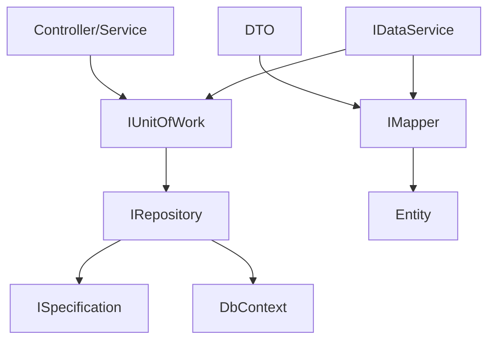

# Fod.Data - Data Access Layer

## Prezentare Generală

Fod.Data reprezintă stratul de acces la date pentru platforma FOD.Components, oferind o abstractizare consistentă pentru operațiunile cu baza de date. Această librărie implementează pattern-uri moderne de acces la date, optimizate pentru aplicațiile enterprise.

## Caracteristici Principale

### 🗄️ Funcționalități Core

- **Generic Repository Pattern** - Operațiuni CRUD standardizate
- **Specification Pattern** - Query-uri complexe reutilizabile
- **Unit of Work** - Management tranzacțional
- **Data Transfer Objects (DTOs)** - Separare între entități și modele de transfer
- **Query Optimization** - Strategii de încărcare eficientă
- **Caching Layer** - Cache integrat pentru performanță

### 🚀 Beneficii

- Abstractizare completă a accesului la date
- Testabilitate îmbunătățită
- Reutilizare cod maximă
- Performanță optimizată
- Mentenanță ușoară

## Arhitectură

### Structura Modulului

```
Fod.Data/
├── Abstractions/
│   ├── IRepository.cs
│   ├── IUnitOfWork.cs
│   ├── ISpecification.cs
│   └── IDataService.cs
├── Implementations/
│   ├── Repository.cs
│   ├── UnitOfWork.cs
│   └── DataService.cs
├── Specifications/
│   ├── BaseSpecification.cs
│   └── Common/
├── DTOs/
│   ├── Base/
│   └── Domain/
├── Mappers/
│   ├── IMapper.cs
│   └── AutoMapperProfile.cs
└── Extensions/
    ├── QueryableExtensions.cs
    └── SpecificationExtensions.cs
```

### Design Patterns



## Configurare și Utilizare

### 1. Instalare

```bash
dotnet add package Fod.Data
dotnet add package Fod.Data.EntityFramework
```

### 2. Configurare în Program.cs

```csharp
using Fod.Data.Extensions;

var builder = WebApplication.CreateBuilder(args);

// Adaugă serviciile Fod.Data
builder.Services.AddFodDataAccess(options =>
{
    options.UseEntityFramework(ef =>
    {
        ef.ConnectionString = builder.Configuration.GetConnectionString("DefaultConnection");
        ef.EnableSensitiveDataLogging = builder.Environment.IsDevelopment();
    });
    
    options.EnableCaching = true;
    options.CacheExpiration = TimeSpan.FromMinutes(5);
    options.EnableQueryLogging = true;
});

// Înregistrare automată repositories
builder.Services.AddRepositories(typeof(Program).Assembly);

// Adaugă AutoMapper
builder.Services.AddAutoMapper(typeof(Program).Assembly);
```

## Repository Pattern

### Interface Generic

```csharp
public interface IRepository<TEntity> where TEntity : class
{
    // Query operations
    Task<TEntity> GetByIdAsync(int id);
    Task<TEntity> FirstOrDefaultAsync(ISpecification<TEntity> spec);
    Task<IReadOnlyList<TEntity>> ListAsync();
    Task<IReadOnlyList<TEntity>> ListAsync(ISpecification<TEntity> spec);
    Task<int> CountAsync(ISpecification<TEntity> spec);
    
    // Command operations
    Task<TEntity> AddAsync(TEntity entity);
    Task UpdateAsync(TEntity entity);
    Task DeleteAsync(TEntity entity);
    Task<int> SaveChangesAsync();
}
```

### Utilizare Repository

```csharp
public class UserService
{
    private readonly IRepository<User> _userRepository;
    private readonly IUnitOfWork _unitOfWork;
    
    public UserService(IUnitOfWork unitOfWork)
    {
        _unitOfWork = unitOfWork;
        _userRepository = _unitOfWork.Repository<User>();
    }
    
    public async Task<UserDto> GetUserByIdAsync(int id)
    {
        var user = await _userRepository.GetByIdAsync(id);
        return _mapper.Map<UserDto>(user);
    }
    
    public async Task<IEnumerable<UserDto>> GetActiveUsersAsync()
    {
        var spec = new ActiveUsersSpecification();
        var users = await _userRepository.ListAsync(spec);
        return _mapper.Map<IEnumerable<UserDto>>(users);
    }
}
```

## Specification Pattern

### Creare Specification

```csharp
public class ActiveUsersSpecification : BaseSpecification<User>
{
    public ActiveUsersSpecification() 
        : base(u => u.IsActive && !u.IsDeleted)
    {
        AddInclude(u => u.Roles);
        AddInclude(u => u.Department);
        AddOrderByDescending(u => u.CreatedAt);
    }
}

public class UsersByDepartmentSpecification : BaseSpecification<User>
{
    public UsersByDepartmentSpecification(int departmentId) 
        : base(u => u.DepartmentId == departmentId)
    {
        AddInclude(u => u.Include(x => x.Department)
                         .ThenInclude(d => d.Manager));
        ApplyPaging(0, 20);
    }
}
```

### Specification Complexe

```csharp
public class AdvancedSearchSpecification : BaseSpecification<Product>
{
    public AdvancedSearchSpecification(ProductSearchCriteria criteria)
    {
        // Build predicate dynamically
        Expression<Func<Product, bool>> filter = p => true;
        
        if (!string.IsNullOrEmpty(criteria.Name))
            filter = filter.And(p => p.Name.Contains(criteria.Name));
            
        if (criteria.MinPrice.HasValue)
            filter = filter.And(p => p.Price >= criteria.MinPrice.Value);
            
        if (criteria.CategoryIds?.Any() ?? false)
            filter = filter.And(p => criteria.CategoryIds.Contains(p.CategoryId));
            
        // Apply filter
        AddCriteria(filter);
        
        // Add includes
        AddInclude(p => p.Category);
        AddInclude(p => p.Images);
        
        // Apply sorting
        switch (criteria.SortBy)
        {
            case "price":
                AddOrderBy(p => p.Price);
                break;
            case "name":
                AddOrderBy(p => p.Name);
                break;
            default:
                AddOrderByDescending(p => p.CreatedAt);
                break;
        }
        
        // Apply paging
        ApplyPaging(criteria.Skip, criteria.Take);
    }
}
```

## Unit of Work Pattern

### Interface

```csharp
public interface IUnitOfWork : IDisposable
{
    IRepository<TEntity> Repository<TEntity>() where TEntity : class;
    Task<int> CompleteAsync();
    Task<IDbContextTransaction> BeginTransactionAsync();
    Task CommitTransactionAsync();
    Task RollbackTransactionAsync();
}
```

### Utilizare cu Tranzacții

```csharp
public class OrderService
{
    private readonly IUnitOfWork _unitOfWork;
    
    public async Task<OrderResult> CreateOrderAsync(CreateOrderDto dto)
    {
        using var transaction = await _unitOfWork.BeginTransactionAsync();
        
        try
        {
            // Create order
            var order = new Order
            {
                CustomerId = dto.CustomerId,
                OrderDate = DateTime.UtcNow,
                Status = OrderStatus.Pending
            };
            
            await _unitOfWork.Repository<Order>().AddAsync(order);
            
            // Add order items
            foreach (var item in dto.Items)
            {
                var orderItem = new OrderItem
                {
                    Order = order,
                    ProductId = item.ProductId,
                    Quantity = item.Quantity,
                    Price = item.Price
                };
                
                await _unitOfWork.Repository<OrderItem>().AddAsync(orderItem);
                
                // Update inventory
                var product = await _unitOfWork.Repository<Product>()
                    .GetByIdAsync(item.ProductId);
                product.Stock -= item.Quantity;
                
                await _unitOfWork.Repository<Product>().UpdateAsync(product);
            }
            
            // Save all changes
            await _unitOfWork.CompleteAsync();
            
            // Commit transaction
            await _unitOfWork.CommitTransactionAsync();
            
            return new OrderResult { Success = true, OrderId = order.Id };
        }
        catch (Exception ex)
        {
            await _unitOfWork.RollbackTransactionAsync();
            throw;
        }
    }
}
```

## Data Services

### Service Layer Pattern

```csharp
public interface IDataService<TEntity, TDto> 
    where TEntity : class 
    where TDto : class
{
    Task<TDto> GetByIdAsync(int id);
    Task<IEnumerable<TDto>> GetAllAsync();
    Task<PagedResult<TDto>> GetPagedAsync(PagedRequest request);
    Task<TDto> CreateAsync(TDto dto);
    Task<TDto> UpdateAsync(int id, TDto dto);
    Task DeleteAsync(int id);
}

public class DataService<TEntity, TDto> : IDataService<TEntity, TDto>
    where TEntity : class, IEntity
    where TDto : class
{
    protected readonly IUnitOfWork _unitOfWork;
    protected readonly IMapper _mapper;
    protected readonly ILogger _logger;
    
    public DataService(
        IUnitOfWork unitOfWork, 
        IMapper mapper,
        ILogger<DataService<TEntity, TDto>> logger)
    {
        _unitOfWork = unitOfWork;
        _mapper = mapper;
        _logger = logger;
    }
    
    public virtual async Task<TDto> GetByIdAsync(int id)
    {
        var entity = await _unitOfWork.Repository<TEntity>().GetByIdAsync(id);
        
        if (entity == null)
            throw new NotFoundException($"{typeof(TEntity).Name} with id {id} not found");
            
        return _mapper.Map<TDto>(entity);
    }
    
    public virtual async Task<TDto> CreateAsync(TDto dto)
    {
        var entity = _mapper.Map<TEntity>(dto);
        
        await _unitOfWork.Repository<TEntity>().AddAsync(entity);
        await _unitOfWork.CompleteAsync();
        
        _logger.LogInformation($"Created {typeof(TEntity).Name} with id {entity.Id}");
        
        return _mapper.Map<TDto>(entity);
    }
}
```

## Query Optimization

### Projection Queries

```csharp
public class OptimizedUserRepository : Repository<User>, IUserRepository
{
    public async Task<IEnumerable<UserSummaryDto>> GetUserSummariesAsync()
    {
        return await Context.Users
            .Where(u => u.IsActive)
            .Select(u => new UserSummaryDto
            {
                Id = u.Id,
                FullName = u.FullName,
                Email = u.Email,
                DepartmentName = u.Department.Name
            })
            .ToListAsync();
    }
    
    public async Task<UserDetailsDto> GetUserDetailsAsync(int userId)
    {
        return await Context.Users
            .Where(u => u.Id == userId)
            .Select(u => new UserDetailsDto
            {
                Id = u.Id,
                FullName = u.FullName,
                Email = u.Email,
                Roles = u.UserRoles.Select(ur => ur.Role.Name).ToList(),
                Permissions = u.UserRoles
                    .SelectMany(ur => ur.Role.Permissions)
                    .Select(p => p.Name)
                    .Distinct()
                    .ToList()
            })
            .FirstOrDefaultAsync();
    }
}
```

### Batch Operations

```csharp
public class BatchRepository<T> : Repository<T> where T : class
{
    public async Task AddRangeAsync(IEnumerable<T> entities)
    {
        await Context.Set<T>().AddRangeAsync(entities);
    }
    
    public async Task UpdateRangeAsync(IEnumerable<T> entities)
    {
        Context.Set<T>().UpdateRange(entities);
        await Task.CompletedTask;
    }
    
    public async Task DeleteRangeAsync(Expression<Func<T, bool>> predicate)
    {
        var entities = await Context.Set<T>().Where(predicate).ToListAsync();
        Context.Set<T>().RemoveRange(entities);
    }
}
```

## Caching

### Cache Integration

```csharp
public class CachedRepository<T> : Repository<T>, ICachedRepository<T> where T : class
{
    private readonly IMemoryCache _cache;
    private readonly string _cacheKeyPrefix;
    
    public CachedRepository(DbContext context, IMemoryCache cache) : base(context)
    {
        _cache = cache;
        _cacheKeyPrefix = $"{typeof(T).Name}_";
    }
    
    public override async Task<T> GetByIdAsync(int id)
    {
        var cacheKey = $"{_cacheKeyPrefix}{id}";
        
        return await _cache.GetOrCreateAsync(cacheKey, async entry =>
        {
            entry.SetSlidingExpiration(TimeSpan.FromMinutes(5));
            return await base.GetByIdAsync(id);
        });
    }
    
    public override async Task UpdateAsync(T entity)
    {
        await base.UpdateAsync(entity);
        
        // Invalidate cache
        var id = entity.GetType().GetProperty("Id")?.GetValue(entity);
        if (id != null)
        {
            _cache.Remove($"{_cacheKeyPrefix}{id}");
        }
    }
}
```

## Testing

### Repository Testing

```csharp
[TestClass]
public class UserRepositoryTests
{
    private ApplicationDbContext _context;
    private IRepository<User> _repository;
    
    [TestInitialize]
    public void Setup()
    {
        var options = new DbContextOptionsBuilder<ApplicationDbContext>()
            .UseInMemoryDatabase(databaseName: Guid.NewGuid().ToString())
            .Options;
            
        _context = new ApplicationDbContext(options);
        _repository = new Repository<User>(_context);
        
        SeedTestData();
    }
    
    [TestMethod]
    public async Task GetActiveUsers_Should_Return_Only_Active_Users()
    {
        // Arrange
        var spec = new ActiveUsersSpecification();
        
        // Act
        var users = await _repository.ListAsync(spec);
        
        // Assert
        Assert.AreEqual(3, users.Count);
        Assert.IsTrue(users.All(u => u.IsActive));
    }
}
```

## Best Practices

### 1. **Separation of Concerns**
- Păstrați logica de business în servicii, nu în repositories
- Folosiți DTOs pentru transfer de date
- Nu expuneți entitățile direct în API

### 2. **Performance**
- Folosiți projection pentru query-uri read-only
- Implementați paginare pentru liste mari
- Utilizați AsNoTracking() pentru query-uri read-only

### 3. **Testing**
- Testați specifications separat
- Folosiți In-Memory database pentru teste unitare
- Mockuiți repository în teste de servicii

## Concluzie

Fod.Data oferă o fundație solidă pentru accesul la date în aplicațiile FOD, combinând pattern-uri dovedite cu optimizări moderne. Prin utilizarea corectă a acestei librării, veți obține cod mai curat, mai testabil și mai performant.