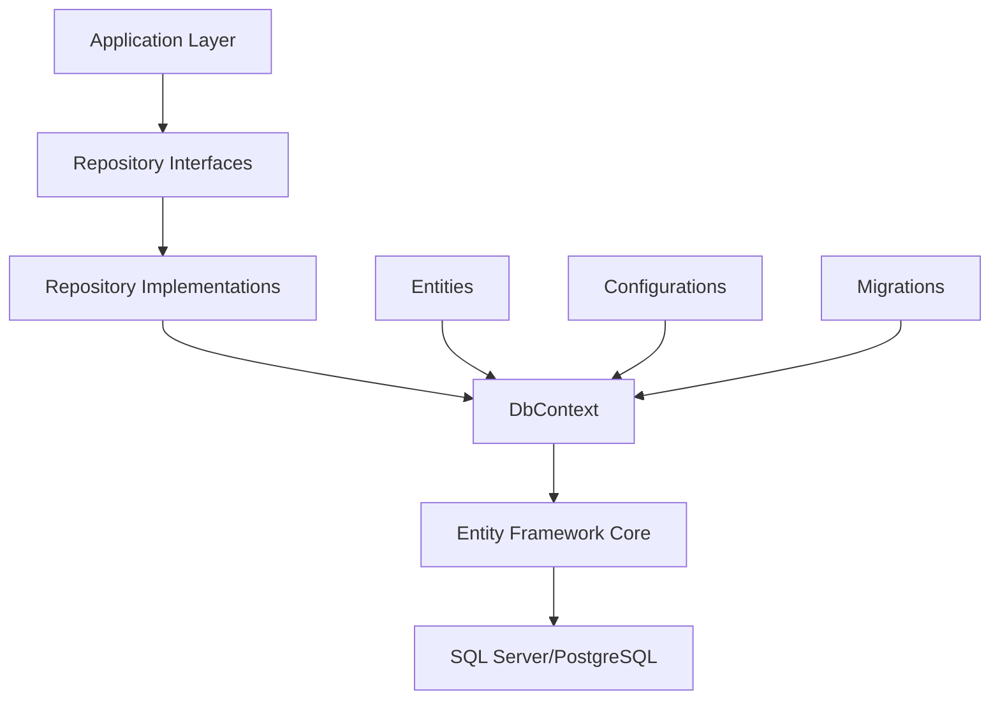

# FOD Entity Framework

## Introducere

FOD.EntityFramework reprezintă stratul de acces la date pentru platforma FOD.Components, oferind o abstractizare robustă peste Entity Framework Core pentru gestionarea datelor în aplicațiile guvernamentale. Această librărie implementează pattern-uri moderne de acces la date, optimizate pentru cerințele specifice ale serviciilor publice digitale.

## Caracteristici Principale

### 🗄️ Funcționalități Core

- **Repository Pattern** - Implementare standardizată pentru toate entitățile
- **Unit of Work** - Gestionare tranzacții complexe
- **Audit Trail** - Istoric complet al modificărilor
- **Soft Delete** - Ștergere logică pentru păstrarea istoricului
- **Multi-tenancy** - Suport pentru aplicații multi-tenant
- **Query Specifications** - Construire query-uri reutilizabile

### 🚀 Optimizări și Performanță

- **Lazy Loading Proxies** - Încărcare întârziată inteligentă
- **Query Caching** - Cache pentru query-uri frecvente
- **Bulk Operations** - Operații în masă optimizate
- **Connection Resiliency** - Reconectare automată
- **Database Migrations** - Versionare și actualizare schemă

## Arhitectură

### Structura Proiectului

```
FOD.EntityFramework/
├── Context/
│   ├── FodDbContext.cs
│   ├── FodDbContextFactory.cs
│   └── ModelConfiguration/
├── Entities/
│   ├── Base/
│   ├── Request/
│   ├── Service/
│   └── User/
├── Repositories/
│   ├── Base/
│   ├── Implementations/
│   └── Interfaces/
├── Specifications/
├── Extensions/
└── Migrations/
```

### Diagrama Arhitecturală



## Configurare și Instalare

### 1. Instalare Pachet NuGet

```bash
dotnet add package FOD.EntityFramework
```

### 2. Configurare în Program.cs

```csharp
using FOD.EntityFramework;
using FOD.EntityFramework.Extensions;

var builder = WebApplication.CreateBuilder(args);

// Adaugă DbContext
builder.Services.AddFodDbContext(options =>
{
    options.UseSqlServer(
        builder.Configuration.GetConnectionString("DefaultConnection"),
        sqlOptions =>
        {
            sqlOptions.MigrationsAssembly("YourProject.Migrations");
            sqlOptions.EnableRetryOnFailure(
                maxRetryCount: 5,
                maxRetryDelay: TimeSpan.FromSeconds(30),
                errorNumbersToAdd: null);
        });
    
    // Opțiuni adiționale
    options.EnableSensitiveDataLogging(builder.Environment.IsDevelopment());
    options.EnableServiceProviderCaching();
});

// Adaugă repositories
builder.Services.AddFodRepositories();

// Adaugă Unit of Work
builder.Services.AddScoped<IUnitOfWork, UnitOfWork>();

// Configurare audit
builder.Services.ConfigureFodAudit(options =>
{
    options.AuditTableName = "AuditLogs";
    options.IncludeEntityChanges = true;
    options.ExcludedTypes = new[] { typeof(AuditLog) };
});

var app = builder.Build();

// Aplică migrații automat (opțional)
if (app.Environment.IsDevelopment())
{
    await app.MigrateDatabaseAsync();
}
```

### 3. Connection String Configuration

```json
{
  "ConnectionStrings": {
    "DefaultConnection": "Server=localhost;Database=FodDb;User Id=sa;Password=YourPassword;TrustServerCertificate=True"
  },
  "EntityFramework": {
    "CommandTimeout": 30,
    "EnableRetryOnFailure": true,
    "MaxRetryCount": 3,
    "MaxRetryDelay": 30,
    "EnableSensitiveDataLogging": false,
    "TrackingBehavior": "TrackAll"
  }
}
```

## Entități de Bază

### 1. BaseEntity

Toate entitățile FOD moștenesc din `BaseEntity`:

```csharp
public abstract class BaseEntity
{
    public int Id { get; set; }
    public DateTime CreatedAt { get; set; }
    public string CreatedBy { get; set; }
    public DateTime? UpdatedAt { get; set; }
    public string UpdatedBy { get; set; }
    public bool IsDeleted { get; set; }
    public DateTime? DeletedAt { get; set; }
    public byte[] RowVersion { get; set; }
}
```

### 2. Exemplu Entitate Personalizată

```csharp
public class FodRequest : BaseEntity
{
    public string RequestNumber { get; set; }
    public int ServiceId { get; set; }
    public int UserId { get; set; }
    public RequestStatus Status { get; set; }
    public DateTime SubmittedAt { get; set; }
    public decimal TotalCost { get; set; }
    
    // Navigation properties
    public virtual FodService Service { get; set; }
    public virtual UserProfile User { get; set; }
    public virtual ICollection<FodRequestFile> Files { get; set; }
    public virtual ICollection<FodRequestPayment> Payments { get; set; }
}
```

### 3. Configurare Entitate

```csharp
public class FodRequestConfiguration : IEntityTypeConfiguration<FodRequest>
{
    public void Configure(EntityTypeBuilder<FodRequest> builder)
    {
        builder.ToTable("FodRequests");
        
        builder.HasKey(e => e.Id);
        
        builder.Property(e => e.RequestNumber)
            .IsRequired()
            .HasMaxLength(50);
            
        builder.HasIndex(e => e.RequestNumber)
            .IsUnique();
            
        builder.Property(e => e.TotalCost)
            .HasPrecision(18, 2);
            
        builder.HasOne(e => e.Service)
            .WithMany(s => s.Requests)
            .HasForeignKey(e => e.ServiceId)
            .OnDelete(DeleteBehavior.Restrict);
            
        builder.HasQueryFilter(e => !e.IsDeleted);
    }
}
```

## Repository Pattern

### 1. Interface Repository Generic

```csharp
public interface IRepository<TEntity> where TEntity : BaseEntity
{
    // Query
    Task<TEntity> GetByIdAsync(int id, CancellationToken cancellationToken = default);
    Task<TEntity> GetByIdWithIncludesAsync(int id, params Expression<Func<TEntity, object>>[] includes);
    Task<IEnumerable<TEntity>> GetAllAsync(CancellationToken cancellationToken = default);
    Task<IPagedList<TEntity>> GetPagedAsync(int pageIndex, int pageSize, Expression<Func<TEntity, bool>> predicate = null);
    
    // Commands
    Task<TEntity> AddAsync(TEntity entity, CancellationToken cancellationToken = default);
    Task AddRangeAsync(IEnumerable<TEntity> entities, CancellationToken cancellationToken = default);
    void Update(TEntity entity);
    void Remove(TEntity entity);
    void RemoveRange(IEnumerable<TEntity> entities);
    
    // Specifications
    Task<TEntity> FirstOrDefaultAsync(ISpecification<TEntity> specification);
    Task<IEnumerable<TEntity>> ListAsync(ISpecification<TEntity> specification);
    Task<int> CountAsync(ISpecification<TEntity> specification);
}
```

### 2. Repository Specializat

```csharp
public interface IFodRequestRepository : IRepository<FodRequest>
{
    Task<FodRequest> GetByRequestNumberAsync(string requestNumber);
    Task<IEnumerable<FodRequest>> GetUserRequestsAsync(int userId, RequestStatus? status = null);
    Task<IEnumerable<FodRequest>> GetPendingRequestsAsync(DateTime olderThan);
    Task<RequestStatistics> GetStatisticsAsync(StatisticsFilter filter);
}

public class FodRequestRepository : Repository<FodRequest>, IFodRequestRepository
{
    public FodRequestRepository(FodDbContext context) : base(context) { }
    
    public async Task<FodRequest> GetByRequestNumberAsync(string requestNumber)
    {
        return await DbSet
            .Include(r => r.Service)
            .Include(r => r.User)
            .Include(r => r.Files)
            .FirstOrDefaultAsync(r => r.RequestNumber == requestNumber);
    }
    
    public async Task<IEnumerable<FodRequest>> GetUserRequestsAsync(int userId, RequestStatus? status = null)
    {
        var query = DbSet.Where(r => r.UserId == userId);
        
        if (status.HasValue)
        {
            query = query.Where(r => r.Status == status.Value);
        }
        
        return await query
            .OrderByDescending(r => r.SubmittedAt)
            .ToListAsync();
    }
}
```

## Specifications Pattern

### 1. Specification Base

```csharp
public abstract class BaseSpecification<T> : ISpecification<T>
{
    public Expression<Func<T, bool>> Criteria { get; }
    public List<Expression<Func<T, object>>> Includes { get; } = new();
    public List<string> IncludeStrings { get; } = new();
    public Expression<Func<T, object>> OrderBy { get; private set; }
    public Expression<Func<T, object>> OrderByDescending { get; private set; }
    public int Take { get; private set; }
    public int Skip { get; private set; }
    public bool IsPagingEnabled { get; private set; }

    protected BaseSpecification(Expression<Func<T, bool>> criteria)
    {
        Criteria = criteria;
    }

    protected void AddInclude(Expression<Func<T, object>> includeExpression)
    {
        Includes.Add(includeExpression);
    }

    protected void ApplyPaging(int skip, int take)
    {
        Skip = skip;
        Take = take;
        IsPagingEnabled = true;
    }

    protected void ApplyOrderBy(Expression<Func<T, object>> orderByExpression)
    {
        OrderBy = orderByExpression;
    }
}
```

### 2. Specification Concretă

```csharp
public class ActiveRequestsSpecification : BaseSpecification<FodRequest>
{
    public ActiveRequestsSpecification(int? serviceId = null) 
        : base(r => r.Status != RequestStatus.Completed && 
                    r.Status != RequestStatus.Cancelled &&
                    (!serviceId.HasValue || r.ServiceId == serviceId.Value))
    {
        AddInclude(r => r.Service);
        AddInclude(r => r.User);
        ApplyOrderByDescending(r => r.SubmittedAt);
    }
}

// Utilizare
var activeRequests = await _requestRepository.ListAsync(
    new ActiveRequestsSpecification(serviceId: 5));
```

## Unit of Work Pattern

### 1. Interface Unit of Work

```csharp
public interface IUnitOfWork : IDisposable
{
    IFodRequestRepository Requests { get; }
    IFodServiceRepository Services { get; }
    IUserRepository Users { get; }
    IRepository<T> Repository<T>() where T : BaseEntity;
    
    Task<int> SaveChangesAsync(CancellationToken cancellationToken = default);
    Task<IDbContextTransaction> BeginTransactionAsync();
    Task CommitTransactionAsync();
    Task RollbackTransactionAsync();
}
```

### 2. Utilizare Unit of Work

```csharp
public class RequestService
{
    private readonly IUnitOfWork _unitOfWork;
    
    public async Task<RequestResult> SubmitRequestAsync(SubmitRequestDto dto)
    {
        using var transaction = await _unitOfWork.BeginTransactionAsync();
        
        try
        {
            // Creare request
            var request = new FodRequest
            {
                ServiceId = dto.ServiceId,
                UserId = dto.UserId,
                Status = RequestStatus.Pending,
                SubmittedAt = DateTime.UtcNow
            };
            
            await _unitOfWork.Requests.AddAsync(request);
            
            // Adaugă fișiere
            foreach (var file in dto.Files)
            {
                var requestFile = new FodRequestFile
                {
                    Request = request,
                    FileName = file.FileName,
                    FileContent = file.Content
                };
                
                await _unitOfWork.Repository<FodRequestFile>().AddAsync(requestFile);
            }
            
            // Salvează modificările
            await _unitOfWork.SaveChangesAsync();
            
            // Commit transaction
            await _unitOfWork.CommitTransactionAsync();
            
            return new RequestResult { Success = true, RequestId = request.Id };
        }
        catch (Exception ex)
        {
            await _unitOfWork.RollbackTransactionAsync();
            throw;
        }
    }
}
```

## Migrații

### 1. Creare Migrație

```bash
# Adaugă o migrație nouă
dotnet ef migrations add AddRequestTable --context FodDbContext --output-dir Migrations

# Actualizează baza de date
dotnet ef database update --context FodDbContext

# Generează script SQL
dotnet ef migrations script --context FodDbContext --output migrations.sql
```

### 2. Migrație Personalizată

```csharp
public partial class AddRequestTable : Migration
{
    protected override void Up(MigrationBuilder migrationBuilder)
    {
        migrationBuilder.CreateTable(
            name: "FodRequests",
            columns: table => new
            {
                Id = table.Column<int>(nullable: false)
                    .Annotation("SqlServer:Identity", "1, 1"),
                RequestNumber = table.Column<string>(maxLength: 50, nullable: false),
                ServiceId = table.Column<int>(nullable: false),
                // alte coloane
            },
            constraints: table =>
            {
                table.PrimaryKey("PK_FodRequests", x => x.Id);
                table.ForeignKey(
                    name: "FK_FodRequests_FodServices_ServiceId",
                    column: x => x.ServiceId,
                    principalTable: "FodServices",
                    principalColumn: "Id",
                    onDelete: ReferentialAction.Restrict);
            });
            
        // Seed data
        migrationBuilder.InsertData(
            table: "RequestStatuses",
            columns: new[] { "Id", "Name", "Description" },
            values: new object[,]
            {
                { 1, "Pending", "În așteptare" },
                { 2, "Processing", "În procesare" },
                { 3, "Completed", "Finalizat" }
            });
    }
}
```

## Query Optimization

### 1. Eager Loading

```csharp
public async Task<FodRequest> GetRequestWithDetailsAsync(int requestId)
{
    return await _context.Requests
        .Include(r => r.Service)
            .ThenInclude(s => s.Provider)
        .Include(r => r.User)
        .Include(r => r.Files)
        .Include(r => r.Payments)
            .ThenInclude(p => p.Transaction)
        .AsSplitQuery() // Pentru query-uri mari
        .FirstOrDefaultAsync(r => r.Id == requestId);
}
```

### 2. Projection

```csharp
public async Task<IEnumerable<RequestSummaryDto>> GetRequestSummariesAsync()
{
    return await _context.Requests
        .Where(r => r.Status == RequestStatus.Active)
        .Select(r => new RequestSummaryDto
        {
            Id = r.Id,
            RequestNumber = r.RequestNumber,
            ServiceName = r.Service.Name,
            UserName = r.User.FullName,
            SubmittedAt = r.SubmittedAt,
            TotalCost = r.TotalCost
        })
        .ToListAsync();
}
```

### 3. Compiled Queries

```csharp
private static readonly Func<FodDbContext, int, Task<FodRequest>> GetRequestByIdQuery =
    EF.CompileAsyncQuery((FodDbContext context, int id) =>
        context.Requests
            .Include(r => r.Service)
            .FirstOrDefault(r => r.Id == id));

public Task<FodRequest> GetRequestByIdCompiledAsync(int id)
{
    return GetRequestByIdQuery(_context, id);
}
```

## Audit și Change Tracking

### 1. Audit Interceptor

```csharp
public class AuditInterceptor : SaveChangesInterceptor
{
    private readonly ICurrentUserService _currentUserService;
    
    public override InterceptionResult<int> SavingChanges(
        DbContextEventData eventData, 
        InterceptionResult<int> result)
    {
        var context = eventData.Context;
        var entries = context.ChangeTracker.Entries<BaseEntity>();
        
        foreach (var entry in entries)
        {
            switch (entry.State)
            {
                case EntityState.Added:
                    entry.Entity.CreatedAt = DateTime.UtcNow;
                    entry.Entity.CreatedBy = _currentUserService.UserId;
                    break;
                    
                case EntityState.Modified:
                    entry.Entity.UpdatedAt = DateTime.UtcNow;
                    entry.Entity.UpdatedBy = _currentUserService.UserId;
                    break;
                    
                case EntityState.Deleted:
                    entry.State = EntityState.Modified;
                    entry.Entity.IsDeleted = true;
                    entry.Entity.DeletedAt = DateTime.UtcNow;
                    break;
            }
        }
        
        return base.SavingChanges(eventData, result);
    }
}
```

### 2. Audit Log Entity

```csharp
public class AuditLog
{
    public int Id { get; set; }
    public string EntityName { get; set; }
    public int EntityId { get; set; }
    public string Action { get; set; }
    public string Changes { get; set; }
    public string UserId { get; set; }
    public DateTime Timestamp { get; set; }
    public string IpAddress { get; set; }
}
```

## Testing

### 1. In-Memory Database pentru Teste

```csharp
public class TestDbContextFactory
{
    public static FodDbContext Create()
    {
        var options = new DbContextOptionsBuilder<FodDbContext>()
            .UseInMemoryDatabase(databaseName: Guid.NewGuid().ToString())
            .Options;
            
        var context = new FodDbContext(options);
        context.Database.EnsureCreated();
        
        // Seed test data
        SeedTestData(context);
        
        return context;
    }
    
    private static void SeedTestData(FodDbContext context)
    {
        context.Services.AddRange(
            new FodService { Id = 1, Name = "Service 1" },
            new FodService { Id = 2, Name = "Service 2" }
        );
        
        context.SaveChanges();
    }
}
```

### 2. Repository Test

```csharp
[TestClass]
public class FodRequestRepositoryTests
{
    private FodDbContext _context;
    private IFodRequestRepository _repository;
    
    [TestInitialize]
    public void Setup()
    {
        _context = TestDbContextFactory.Create();
        _repository = new FodRequestRepository(_context);
    }
    
    [TestMethod]
    public async Task GetByRequestNumber_Should_Return_Request_With_Includes()
    {
        // Arrange
        var requestNumber = "REQ-001";
        
        // Act
        var result = await _repository.GetByRequestNumberAsync(requestNumber);
        
        // Assert
        Assert.IsNotNull(result);
        Assert.AreEqual(requestNumber, result.RequestNumber);
        Assert.IsNotNull(result.Service);
        Assert.IsNotNull(result.User);
    }
    
    [TestCleanup]
    public void Cleanup()
    {
        _context?.Dispose();
    }
}
```

## Best Practices

### 1. Async/Await Pattern

```csharp
// ✅ Bine
public async Task<IEnumerable<FodRequest>> GetRequestsAsync()
{
    return await _context.Requests
        .Where(r => r.Status == RequestStatus.Active)
        .ToListAsync();
}

// ❌ Evitați
public IEnumerable<FodRequest> GetRequests()
{
    return _context.Requests
        .Where(r => r.Status == RequestStatus.Active)
        .ToList(); // Blochează thread-ul
}
```

### 2. Dispose Pattern

```csharp
public class RequestService : IDisposable
{
    private readonly FodDbContext _context;
    private bool _disposed;
    
    public void Dispose()
    {
        Dispose(true);
        GC.SuppressFinalize(this);
    }
    
    protected virtual void Dispose(bool disposing)
    {
        if (!_disposed)
        {
            if (disposing)
            {
                _context?.Dispose();
            }
            _disposed = true;
        }
    }
}
```

### 3. Query Filters Globale

```csharp
protected override void OnModelCreating(ModelBuilder modelBuilder)
{
    // Soft delete filter global
    modelBuilder.Entity<BaseEntity>()
        .HasQueryFilter(e => !e.IsDeleted);
        
    // Multi-tenancy filter
    modelBuilder.Entity<ITenantEntity>()
        .HasQueryFilter(e => e.TenantId == _currentTenantId);
}
```

## Performanță și Scalare

### 1. Connection Pooling

```csharp
builder.Services.AddDbContext<FodDbContext>(options =>
{
    options.UseSqlServer(connectionString, sqlOptions =>
    {
        sqlOptions.EnableRetryOnFailure();
    });
}, ServiceLifetime.Scoped, ServiceLifetime.Singleton);
```

### 2. Bulk Operations

```csharp
public async Task BulkInsertRequestsAsync(IEnumerable<FodRequest> requests)
{
    using var bulkCopy = new SqlBulkCopy(_connectionString);
    
    bulkCopy.DestinationTableName = "FodRequests";
    bulkCopy.BatchSize = 1000;
    
    var dataTable = requests.ToDataTable();
    await bulkCopy.WriteToServerAsync(dataTable);
}
```

## Resurse și Documentație

- [Entity Framework Core Documentation](https://docs.microsoft.com/ef/core/)
- [FOD Entity Framework Wiki](https://wiki.fod.md/entity-framework)
- [Performance Best Practices](https://docs.microsoft.com/ef/core/performance/)
- [Migration Guide](https://wiki.fod.md/ef-migrations)

## Concluzie

FOD.EntityFramework oferă o fundație solidă pentru gestionarea datelor în aplicațiile guvernamentale, combinând puterea Entity Framework Core cu pattern-uri dovedite și optimizări specifice. Prin utilizarea repository pattern, specifications și unit of work, dezvoltatorii pot crea aplicații scalabile și ușor de întreținut.