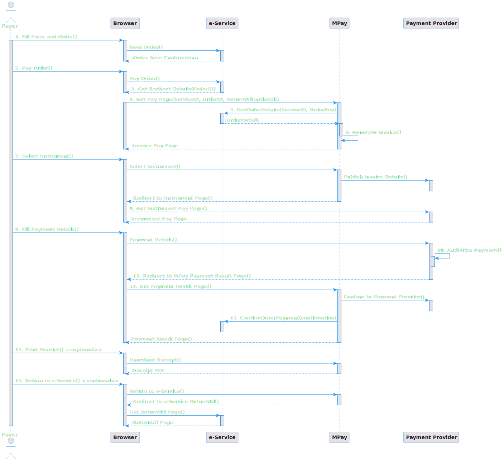
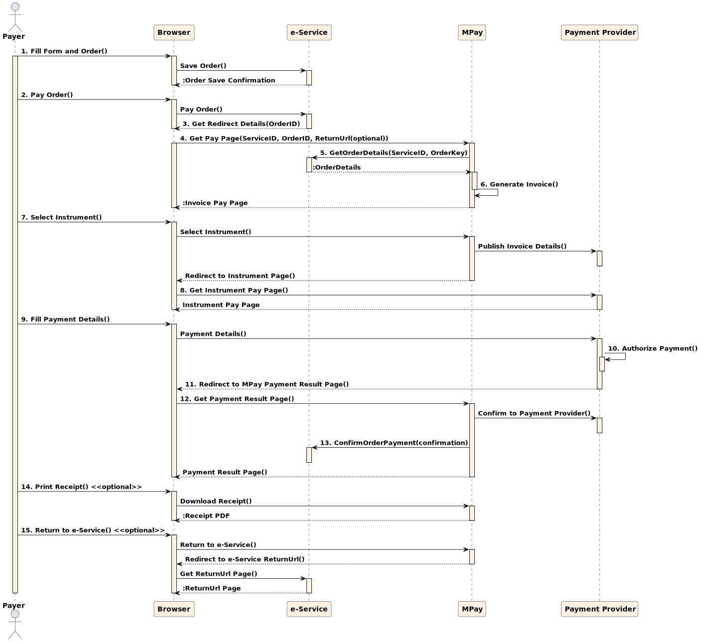

#Scenariul de inretacțiune

Deoarece MPay integrează mai mulți prestatori de servicii electronice cu plată și diferiți 
prestatori de servicii de plată, care oferă o varietate de instrumente de plată, există multe 
moduri în care un plătitor poate interacționa cu acesta.

##**Comanda și plata online**
  
<picture class="theme-picture">
  
  
</picture>

###Descrierea scenariului:

1. Plătitorul completează și trimite o comandă pe pagina prestatorului de serviciu. Comanda este păstrată în baza de date a prestatorului de serviciu;
2. Pagina de confirmare a comenzii afișează butonul „**Plătiți**”.
3. Tastarea acestui buton, redirecționează plătitorul către pagina MPay.
4. Browserul transmite parametrii **ServiceID**, **OrderKey** și opțional **ReturnUrl** pe pagina de plată MPay (vedeti capitolul Efectuarea redirecționării).
5. Până la afișarea paginii de plată, MPay invocă operațiunea **GetOrderDetails** din interfeta **IServiceProvider** implementată de prestatorul de serviciu.
6. Pe baza detaliilor comenzii returnate, MPay creează sau actualizează o factură existentă și arată detaliile plătitorului.
7. Plătitorul selectează o metodă de plată (instrument). Pentru plățile cu cardul bancar, aceasta înseamnă publicarea detaliilor facturii către procesatorul de carduri corespunzător (care este unul dintre prestatorii de servicii de plată).
8. MPay redirecționează browserul către pagina de plată specifică instrumentului.
9. Plătitorul completează detaliile de plată necesare (cum ar fi detaliile cardului) și trimite plata pentru autorizare.
10. Prestatorul de servicii de plată efectuează autorizația de plată corespunzătoare.
11. Prestatorul de servicii de plată redirecționează browserul către pagina cu rezultatele plății MPay.
12. Înainte de a afișa rezultatele plății, MPay generează o confirmare de plată de la prestatorul de servicii de plată.
13. Dacă plata este efectuată cu succes, MPay trimite o confirmare de plată către prestatorul de serviciu, invocând operațiunea **ConfirmOrderPayment** a interfetei **IServiceProvider** implementată de serviciul web și afișează plătitorului rezultatele plății. Asigurațivă că apelul **ConfirmOrderPayment** poate fi reîncercat de mai multe ori, până când reușește. Aceasta înseamnă că toate implementările trebuie să fie idempotente, adică apelurile multiple nu trebuie considerate plăți multiple.
14. Opțional, plătitorul poate descărca și imprima nota de plată.
15. Opțional, dacă **ReturnUrl** a fost setat la pasul 4, plătitorul poate alege să revină la pagina prestatorului de serviciu. În acest caz, MPay redirecționează browserul către adresa din **ReturnUrl**.

##**Plătește o notă de plată existentă**

###Un alt scenariu este plata pentru o comandă existentă:

1. Plătitorul acceseaza MPay (<https://testmpay.gov.md> pentru testare sau <https://mpay.gov.md> pentru mediu de producție).
Plătitorul selectează un serviciu pentru care are numarul comanzii de la prestatorul de serviciu.
2. Plătitorul introduce numărul comenzii (de exemplu numărul comenzii/cererii, etc.)
3. Scenariul continuă cu p.5 din [Comanda si plata online](./#comanda-si-plata-online), adică comanda este căutată prin invocarea operațiunii **GetOrderDetails** a interfetei **IServiceProvider**.